# 购物车模块-接口说明

## 一、购物车模块概述：	

​	购物车模块主要提供用户本产品的基础。购物车模块提供一下功能：

>添加购物车
>
>查询购物车
>
>删除购物车
>
>购物车商品数量添加/减少
>
>购物车商品单选/取消单选
>
>购物车商品全选/取消全选
>
>合并购物车

## 二、事件定义

### 添加购物车

​		用户未登陆状态下进入商品详情页，选择规格和数量，将商品加入到购物车，数据将保存到前端的浏览器的本地存储里。

​		用户登陆状态下进入商品详情页，选择规格和数量，将商品加入到购物车，前端会通过ajax进行与后端交互。

### 查询购物车

​		用户未登录状态下进入购物车页面，前端通过浏览器的本地存储保存数据展示给用户。

​		用户登录状态下进入购物车页面，后端通过redis存好的商品数据，传给前端展示给用户。

### 删除购物车

​		用户进入购物车页面，点击购物车某个商品删除按钮，会有一个弹框显示确定删除和不删除，点击确定删除按钮，商品会被删除。

### 购物车商品

​		商品数量增加和减少： 用户进入购物车页面，点击商品 “+” 按钮，将商品数量增加1个。点击商品 “-” 按钮，将商品数量减少1个。

​		商品单选和取消单选：用户进入购物车页面，默认进入购物车页面单选是 ”√“ ，取消单件商品点击单选按钮，按钮显示空，选择单件商品点击单选按钮，按钮显示 ”√“。

​		商品全选和取消全选：用户进入购物车页面，默认进入购物车页面全选是 ”√“ ，取消全部商品点击全选按钮，按钮显示空，选择全部商品点击全选按钮，按钮显示 ”√“。

### 合并购物车

​		用户在登陆时，创建token，会将用户未登陆状态下浏览器本地存储的购物车商品数据传给后端，后端通过redis存储的商品数量，做数量比较将商品数量最多的存入redis，返还给前端显示。


## 三、API接口说明

### 1.添加购物车

在登陆的状态下添加购物车

#### 事件触发：

页面名：**product_details.html**

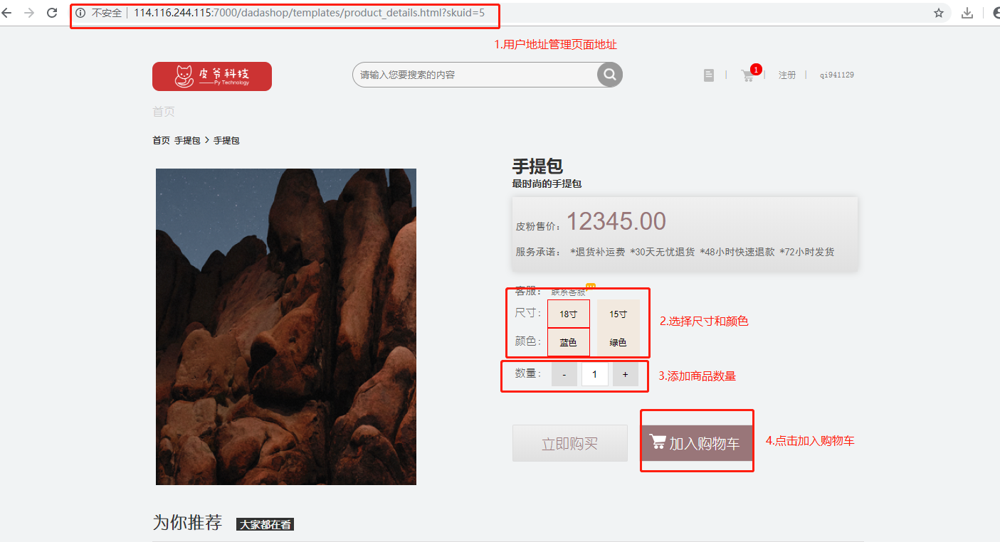

#### 触发结果：

​	触发成功：

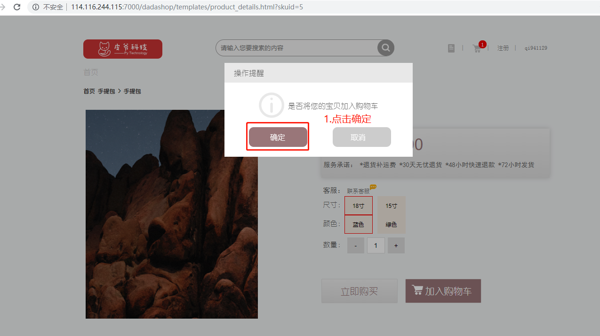

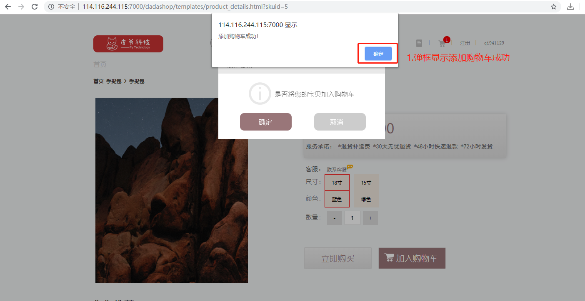

​	触发失败：


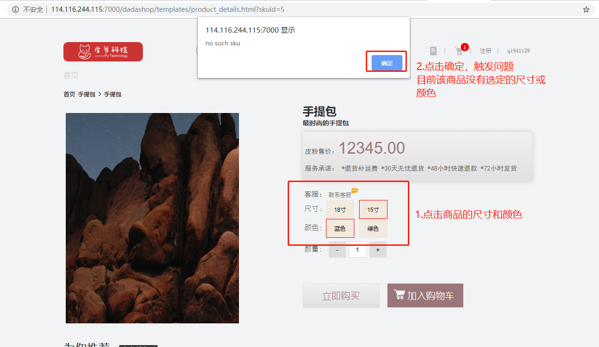

**URL**： ``127.0.0.1:8000/v1/carts/<username> ``

**请求方式**：POST

**请求参数**：JSON

|  参数  | 类型 | 是否必须 |    说明    |
| :----: | :--: | :------: | :--------: |
| sku_id | int  |    是    | 商品sku_id |
| count  | int  |    是    |    数量    |

```
请求士例：
{ "sku_id":2,"count":"1"}
```

**返回值**：JSON

**响应格式**：

```
# 正确响应：
{"code":200,"data":skus_list}

# 错误响应：
{"code":xxx,"error":xxx}
```

| 字段  |   含义   | 类型 | 备注                        |
| :---: | :------: | :--: | --------------------------- |
| code  |  状态码  | int  | 默认正常为200，异常见状态码 |
| data  | 具体数据 | dict | 与error二选一               |
| error | 错误信息 | char | 与data二选一                |

skus_list参数信息

| 参数               | 类型    | 是否必须 | 说明                            |
| ------------------ | ------- | -------- | ------------------------------- |
| id                 | int     | 是       | 商品sku_id                      |
| name               | str     | 是       | 商品名称                        |
| count              | int     | 是       | 商品数量                        |
| default_image_url  | str     | 是       | 商品默认图片路径                |
| price              | decimal | 是       | 商品单价                        |
| sku_sale_attr_name | list    | 是       | 商品属性                        |
| sku_sale_attr_val  | list    | 是       | 商品属性值                      |
| selected           | int     | 是       | 商品的选中状态（0未选中,1选中） |

```python
#sku_list中数据示例 [{"id":"","name":"","count":"","selected":"","default_image_url":"","price":"","sku_sale_attr_na me":[],"sku_sale_attr_val":[]},{"":""...}]
```

状态码参数：

| 状态码 | 响应信息         | 原因短句                    |
| ------ | ---------------- | --------------------------- |
| 200    | 正常             | OK                          |
| 30101  | 未找到商品       | SKU query error             |
| 30102  | 传参不正确       | Incorrect pass of reference |
| 30103  | 购买数量超过库存 | exceeds the inventory       |
| 30104  | 未找到用户       | User query error            |

#### 后端代码:

```python
redis_conn = get_redis_connection('cart')
class CartVIew(View):
   def dispatch(self, request, *args, **kwargs):
        if request.method in ("POST","DELETE"):
            cart_dict = json.loads(request.body)
            sku_id = cart_dict.get('sku_id')
            if not sku_id:
                return JsonResponse({'code': 30102, 'error': '没有sku_id参数'})
            try:
                sku = SKU.objects.get(id=sku_id)  
            except Exception as e:
                print(e)
                return JsonResponse({'code': 30101, 'error': "未找到商品"})
            request.cart_dict = cart_dict
            request.sku_id = sku_id
            request.sku = sku
            return super().dispatch(request, *args, **kwargs)
        return super().dispatch(request, *args, **kwargs)

    
    @logging_check
    def post(self, request, username):
        cart_dict = request.cart_dict
        sku_id = request.sku_id
        sku = request.sku 
        count = cart_dict.get('count')
        try:
            count = int(count)
        except Exception as e:
            print(e)
            return JsonResponse({'code': 30102, 'error': "传参不正确"})
        if count > sku.stock:
            return JsonResponse({'code': 30103, 'error': '购买数量超过库存'})
        user = request.user
        if user.username != username:
            return JsonResponse({'code': 30104, 'error': '非登录者用户'})
        redis_cart = redis_conn.hgetall('cart_%d' % user.id)  # {b'9': b'{"count": 18, "selected": 1}'}

        # 如果redis中存在 则累增
        if sku_id.encode() in redis_cart.keys():
            redis_c = redis_conn.hget('cart_%d' % user.id, sku_id)  # b'{"count": 21, "selected": 1}'
            count_r = int(json.loads(redis_c)['count'])
            count_r += count     
            if count_r > sku.stock:
                return JsonResponse({'code': 30103, 'error': '购买数量超过库存'})
            status = json.dumps({'count': count_r, 'selected': 1})
            redis_conn.hset('cart_%d' % user.id, sku_id, status)
        # 否则hmset插入Redis
        else:
            # 默认都为勾选状态 1勾选 0未勾选
            status = json.dumps({'count': count, 'selected': 1})  # {"count": 21, "selected": 1}
            redis_conn.hset('cart_%d' % user.id, sku_id, status)
            print("管道2执行完毕")
        skus_list = self.get_cart_list(user.id)
        return JsonResponse({'code': 200, 'data': skus_list})
    
    
    def get_cart_list(self, user_id):
        '''
        :param user_id: 用户的id
        :return: reqsponse 列表 [{"id":"","name":"","count":"","selected":""},{"":""...}]
        '''
        cart_dict = {}
        # 重新去redis数据
        redis_cart = redis_conn.hgetall('cart_%d' % user_id)
        for sku_id, status in redis_cart.items():
            cart_dict[int(sku_id.decode())] = {
                'state': json.loads(status),
            }
        skus = SKU.objects.filter(id__in=cart_dict.keys())
        skus_list = []
        for sku in skus:
            sku_dict = {}
            sku_dict['id'] = sku.id
            sku_dict['name'] = sku.name
            sku_dict['count'] = int(cart_dict[sku.id]['state']['count'])
            sku_dict['selected'] = int(cart_dict[sku.id]['state']['selected'])
            sku_dict['default_image_url'] = str(sku.default_image_url)
            sku_dict['price'] = sku.price
            sku_sale_attr_name = []
            sku_sale_attr_val = []

            saleattr_vals = SaleAttrValue.objects.filter(sku_id=sku.id)
            for saleattr_val in saleattr_vals:
                #属性值
                sku_sale_attr_val.append(saleattr_val.sale_attr_value_name)
                saleattrname = SPUSaleAttr.objects.filter(saleattrvalue=saleattr_val)[0]
                #属性名称
                sku_sale_attr_name.append(saleattrname.sale_attr_name)


            sku_dict['sku_sale_attr_name'] = sku_sale_attr_name
            sku_dict['sku_sale_attr_val'] = sku_sale_attr_val
            skus_list.append(sku_dict)
        return skus_list
```


### 2.查询购物车

#### 事件触发:

页面名：**index.html**

页面名：**cart.html** 

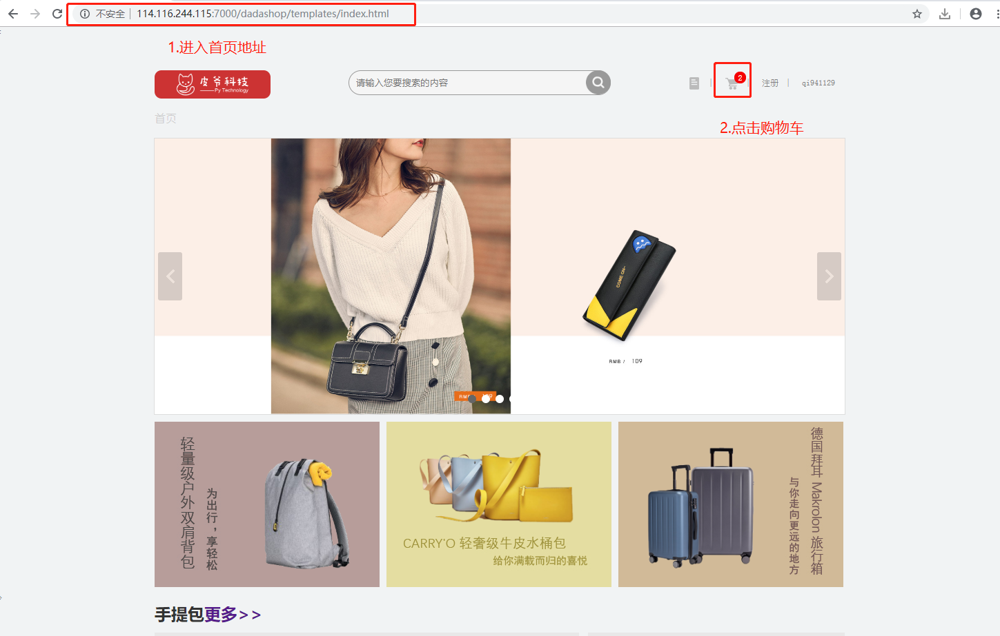

#### 触发结果:

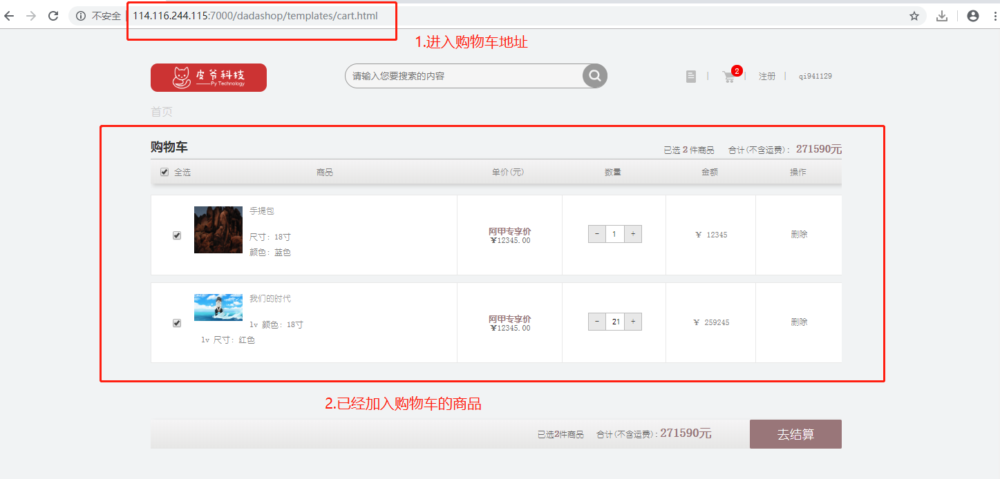


**URL**： 127.0.0.1:8000/v1/carts/<username>

**请求方式**: GET

**请求参数**：无

**返回值**：JSON

**响应格式**：

```
# 正常响应： 
{"code":200,"data":skus_list}

# 异常响应
{"code":xxx,"error"：xxxx}
```

| 字段  | 含义     | 类型 | 备注                        |
| ----- | -------- | ---- | --------------------------- |
| code  | 状态码   | int  | 默认正常为200，异常见状态码 |
| data  | 具体数据 | dict | 与error二选一               |
| error | 错误信息 | char | 与data二选一                |

sku_list参数信息

| 参数               | 类型    | 是否必须 | 说明                             |
| ------------------ | ------- | -------- | -------------------------------- |
| id                 | int     | 是       | 商品sku_id                       |
| name               | str     | 是       | 商品名称                         |
| count              | int     | 是       | 商品数量                         |
| default_image_url  | str     | 是       | 商品默认图片路径                 |
| price              | decimal | 是       | 商品单价                         |
| sku_sale_attr_name | list    | 是       | 商品属性                         |
| sku_sale_attr_val  | list    | 是       | 商品属性值                       |
| selected           | int     | 是       | 商品的选中状态（0未选中，1选中） |

```python
#sku_list中数据示例 [{"id":"","name":"","count":"","selected":"","default_image_url":"","price":"","sku_sale_attr_na me":[],"sku_sale_attr_val":[]},{"":""...}]
```

状态码参数

| 状态码 | 响应信息   | 原因短语         |
| ------ | ---------- | ---------------- |
| 200    | 正常       | OK               |
| 30104  | 未找到用户 | User query error |

#### 后端代码:

```python
redis_conn = get_redis_connection('cart')

class CartVIew(View):
    @logging_check
    def get(self, request, username):
        user = request.user
        if user.username != username:
            return JsonResponse({'code': 30104, 'error': '非登录者用户'})
        redis_cart = redis_conn.hgetall('cart_%d' % user.id)
        for s_id in redis_cart.keys():
            redis_c = redis_conn.hget('cart_%d' % user.id, s_id)
            count_r = int(json.loads(redis_c)['count'])
            status = json.dumps({'count': count_r, 'selected': 1})
            redis_conn.hset('cart_%d' % user.id, s_id, status)
        skus_list = self.get_cart_list(user.id)
        return JsonResponse({'code': 200, 'data': skus_list})
    
    
```


### 3.删除购物车数据

#### 事件触发:

页面名：**cart.html** 

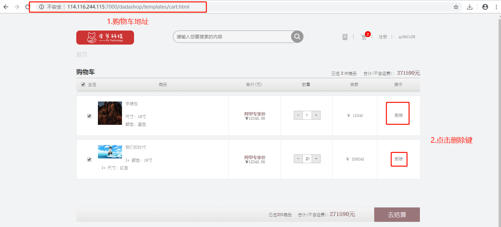

#### 触发结果:

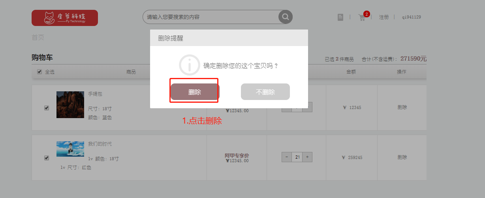

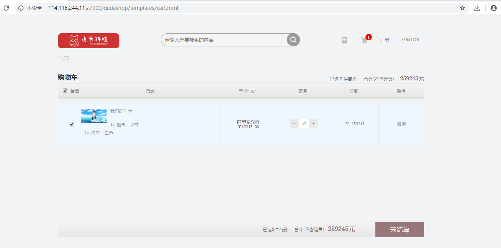


**URL**： 127.0.0.1:8000/v1/carts/<username> 

**请求方式**：DELETE

**请求参数**

```python
#请求参数示例： 
{"sku_id":1001}
```

| 参数   | 类型 | 是否必须 | 说明       |
| ------ | ---- | -------- | ---------- |
| sku_id | int  | 是       | 商品sku_id |

**返回值**：json

**响应格式**：

```python
# 正常响应： 
{"code":200,"data":skus_list}

# 异常响应
{"code":xxx,"error"：xxxx}
```

| 字段  | 含义     | 类型 | 备注                            |
| ----- | -------- | ---- | ------------------------------- |
| code  | 状态码   | int  | 默认正常为200，异常见状态码参考 |
| data  | 具体数据 | dict | 与error二选一                   |
| error | 错误信息 | char | 与data二选一                    |

skus_list参数信息

| 参数               | 类型    | 是否必须 | 说明                             |
| ------------------ | ------- | -------- | -------------------------------- |
| id                 | int     | 是       | 商品sku_id                       |
| name               | str     | 是       | 商品名称                         |
| count              | int     | 是       | 商品数量                         |
| default_image_url  | str     | 是       | 商品默认图片路径                 |
| price              | decimal | 是       | 商品单价                         |
| sku_sale_attr_name | list    | 是       | 商品属性                         |
| sku_sale_attr_val  | list    | 是       | 商品属性值                       |
| selected           | int     | 是       | 商品的选中状态（0未选中，1选中） |

```python
#sku_list中数据示例 [{"id":"","name":"","count":"","selected":"","default_image_url":"","price":"","sku_sale_attr_na me":[],"sku_sale_attr_val":[]},{"":""...}]
```

状态码参考

| 状态码 | 响应信息   | 原因短句         |
| ------ | ---------- | ---------------- |
| 200    | 正常       | OK               |
| 30101  | 未找到商品 | SKU query error  |
| 30104  | 未找到用户 | User query error |

#### 后端代码

```python
redis_conn = get_redis_connection('cart')
class CartVIew(View):
    def dispatch(self, request, *args, **kwargs):
        if request.method in ("POST","DELETE"):
            cart_dict = json.loads(request.body)
            sku_id = cart_dict.get('sku_id')
            if not sku_id:
                return JsonResponse({'code': 30102, 'error': '没有sku_id参数'})
            try:
                sku = SKU.objects.get(id=sku_id)  # 11: 红袖添香
            except Exception as e:
                print(e)
                return JsonResponse({'code': 30101, 'error': "未找到商品"})
            request.cart_dict = cart_dict
            request.sku_id = sku_id
            request.sku = sku
            return super().dispatch(request, *args, **kwargs)
        return super().dispatch(request, *args, **kwargs)
    
    
    @logging_check
    def delete(self, request, username):
        sku_id = request.sku_id
        user = request.user
        if user.username != username:
            return JsonResponse({'code': 30104, 'error': '非登录者用户'})

        # 从hash值中删除该SKU_ID
        redis_conn.hdel('cart_%d' % user.id, sku_id)
        skus_list = self.get_cart_list(user.id)
        return JsonResponse({'code': 200, 'data': skus_list})

    
```


### 4.购物车页面商品数量增加

#### 事件触发:

页面名：**cart.html** 

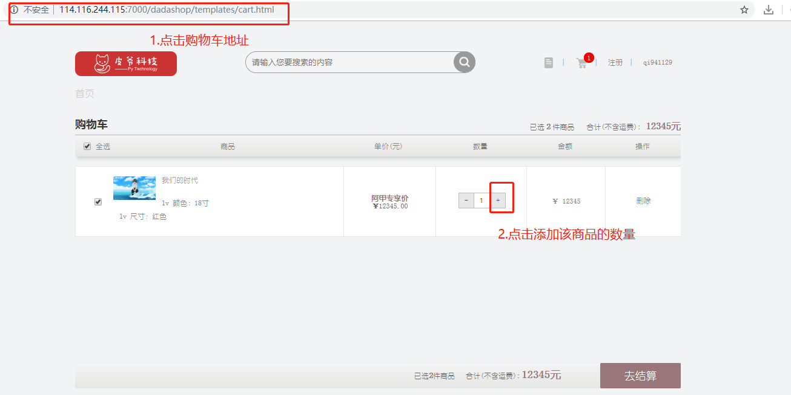

#### 触发结果:

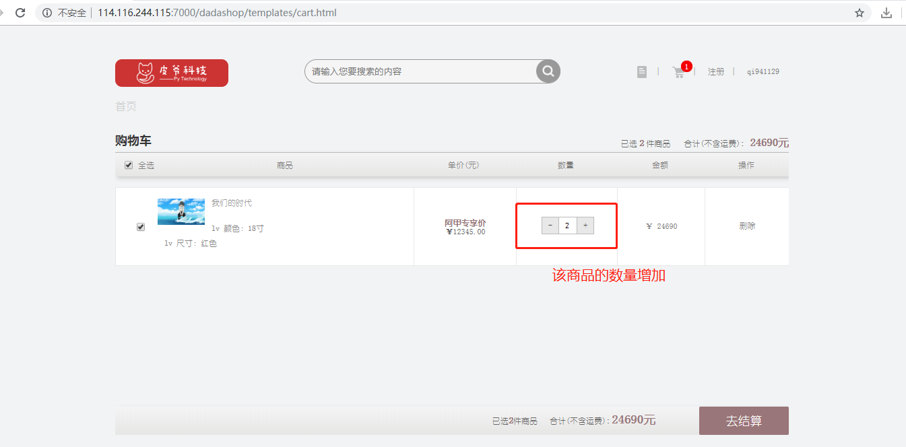


**URL**： 127.0.0.1:8000/v1/carts/<username> 

**请求方式**：PUT

**请求参数**：JSON

| 参数   | 类型 | 是否必须 | 说明           |
| ------ | ---- | -------- | -------------- |
| sku_id | int  | 是       | 商品sku_id     |
| count  | int  | 是       | 前端显示的数量 |
| state  | str  | 是       | 判断事件状态   |

```python
#请求示例 
{'sku_id':1001,count:1,state:'add'}
```

**返回值**：JSON

**响应格式**：

```python
# 正常响应： 
{"code":200,"data":skus_list}

# 异常响应
{"code":xxx,"error"：xxxx}
```

| 字段  | 含义     | 类型 | 备注                        |
| ----- | -------- | ---- | --------------------------- |
| code  | 状态码   | int  | 默认正常为200，异常见状态码 |
| data  | 具体数据 | dict | 与error二选一               |
| error | 错误信息 | char | 与data二选一                |

skus_list参数信息

| 参数               | 类型    | 是否必须 | 说明                             |
| ------------------ | ------- | -------- | -------------------------------- |
| id                 | int     | 是       | 商品sku_id                       |
| name               | str     | 是       | 商品名称                         |
| count              | int     | 是       | 商品数量                         |
| default_image_url  | str     | 是       | 商品默认图片路径                 |
| price              | decimal | 是       | 商品单价                         |
| sku_sale_attr_name | list    | 是       | 商品属性                         |
| sku_sale_attr_val  | list    | 是       | 商品属性值                       |
| selected           | int     | 是       | 商品的选中状态（0未选中，1选中） |

```python
#sku_list中数据示例 [{"id":"","name":"","count":"","selected":"","default_image_url":"","price":"","sku_sale_attr_na me":[],"sku_sale_attr_val":[]},{"":""...}]
```

状态码参考

| 状态码 | 响应信息   | 原因短语         |
| ------ | ---------- | ---------------- |
| 200    | 正常       | OK               |
| 30101  | 未找到商品 | SKU query error  |
| 30104  | 未找到用户 | User query error |

#### 后端代码

```python
redis_conn = get_redis_connection('cart')

class CartVIew(View):
    @logging_check
    def put(self, request, username):
        cart_dict = json.loads(request.body)
        state = cart_dict.get('state')
        user = request.user
        if user.username != username:
            return JsonResponse({'code': 30104, 'error': '非登录者用户'})

        # 判断增加还是减少
        if state == 'add' or state == "del":
            sku_id = cart_dict.get('sku_id')
            try:
                sku = SKU.objects.get(id=sku_id)
            except Exception as e:
                return JsonResponse({'code': 30101, 'error': "未找到商品"})
            redis_c = redis_conn.hget('cart_%d' % user.id, sku_id)
            if not redis_c:
                return JsonResponse({'code': 30101, 'error': '未找到商品'})
            count = int(json.loads(redis_c)['count'])

            # 检查数据
            if state == 'add':
                # 向hash中存储商品的ID,和数量
                count += 1
                if count > sku.stock:
                    return JsonResponse({'code': 30103, 'error': '购买数量超过库存'})
                status = json.dumps({'count': count, 'selected': 1})
                redis_conn.hset('cart_%d' % user.id, sku.id, status)
                skus_list = self.get_cart_list(user.id)
                return JsonResponse({'code': 200, 'data': skus_list})
            
      
```


### 5.购物车页面商品数量减少

#### 事件触发

页面名：**cart.html** 

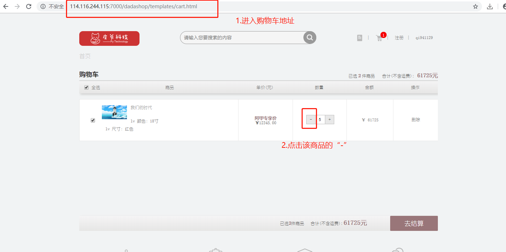

#### 触发结果

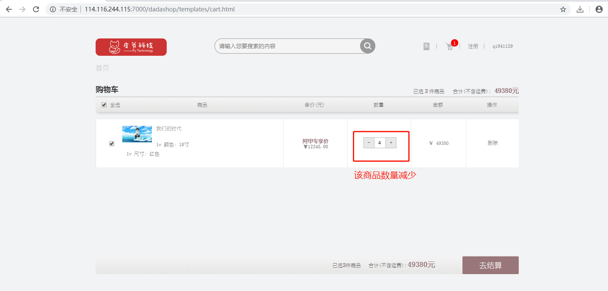


**URL**： 127.0.0.1:8000/v1/carts/<username> 

**请求方式**: PUT

**请求参数**：JSON

| 参数   | 类型 | 是否必须 | 说明         |
| ------ | ---- | -------- | ------------ |
| sku_id | int  | 是       | 商品的sku_id |
| count  | int  | 是       | 前端显示数量 |
| state  | str  | 是       | 判断事件状态 |

```python
#请求示例： 
{'sku_id':1001,count:1,state:'del'}
```

**返回值**：JSON

**响应格式**：

```
# 正常响应： 
{"code":200,"data":skus_list}

# 异常响应
{"code":xxx,"error"：xxxx}
```

| 字段  | 含义     | 类型 | 备注                        |
| ----- | -------- | ---- | --------------------------- |
| code  | 状态码   | int  | 默认正常为200，异常见状态码 |
| data  | 具体数据 | dict | 与error二选一               |
| error | 错误信息 | char | 与data二选一                |

skus_list参数信息

| 参数               | 类型    | 是否必须 | 说明                             |
| ------------------ | ------- | -------- | -------------------------------- |
| id                 | int     | 是       | 商品sku_id                       |
| name               | str     | 是       | 商品名称                         |
| count              | int     | 是       | 商品数量                         |
| default_image_url  | str     | 是       | 商品默认图片路径                 |
| price              | decimal | 是       | 商品单价                         |
| sku_sale_attr_name | list    | 是       | 商品属性                         |
| sku_sale_attr_val  | list    | 是       | 商品属性值                       |
| selected           | int     | 是       | 商品的选中类型（0未选中，1选中） |

```python
#sku_list中数据示例 [{"id":"","name":"","count":"","selected":"","default_image_url":"","price":"","sku_sale_attr_na me":[],"sku_sale_attr_val":[]},{"":""...}]
```

状态码参数

| 状态码 | 响应信息   | 原因短语         |
| ------ | ---------- | ---------------- |
| 200    | 正常       | OK               |
| 30101  | 未找到商品 | SKU query error  |
| 30104  | 未找到用户 | User query error |

#### 后端代码

```python
redis_conn = get_redis_connection('cart')

class CartVIew(View):
    @logging_check
    def put(self, request, username):
        cart_dict = json.loads(request.body)
        state = cart_dict.get('state')
        user = request.user
        if user.username != username:
            return JsonResponse({'code': 30104, 'error': '非登录者用户'})

        # 判断增加还是减少
        if state == 'add' or state == "del":
            sku_id = cart_dict.get('sku_id')
            try:
                sku = SKU.objects.get(id=sku_id)
            except Exception as e:
                return JsonResponse({'code': 30101, 'error': "未找到商品"})
            redis_c = redis_conn.hget('cart_%d' % user.id, sku_id)
            if not redis_c:
                return JsonResponse({'code': 30101, 'error': '未找到商品'})
            count = int(json.loads(redis_c)['count'])

            # 检查数据
            if state == 'del':
                if count > 1:
                    count -= 1
                    status = json.dumps({'count': count, 'selected': 1})
                    redis_conn.hset('cart_%d' % user.id, sku.id, status)
                    skus_list = self.get_cart_list(user.id)
                else:
                    status = json.dumps({'count': 1, 'selected': 1})
                    redis_conn.hset('cart_%d' % user.id, sku.id, status)
                    skus_list = self.get_cart_list(user.id)
                return JsonResponse({'code': 200, 'data': skus_list})
            
            
```


### 6.购物车商品单选

#### 事件触发

页面名：**cart.html** 

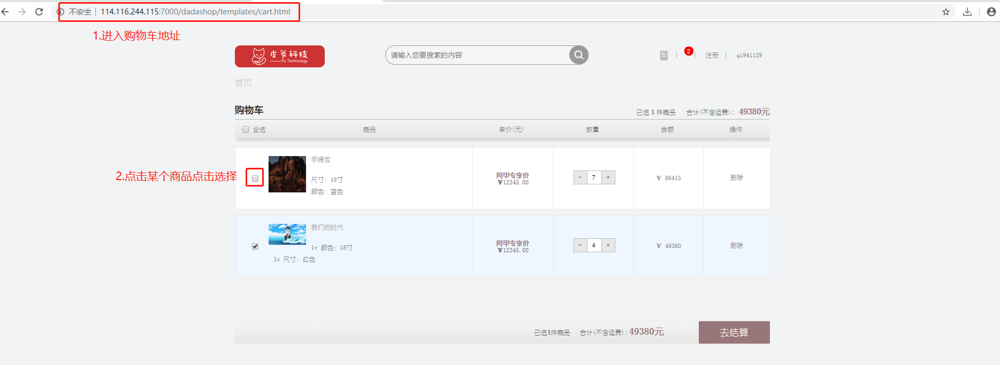

#### 触发结果

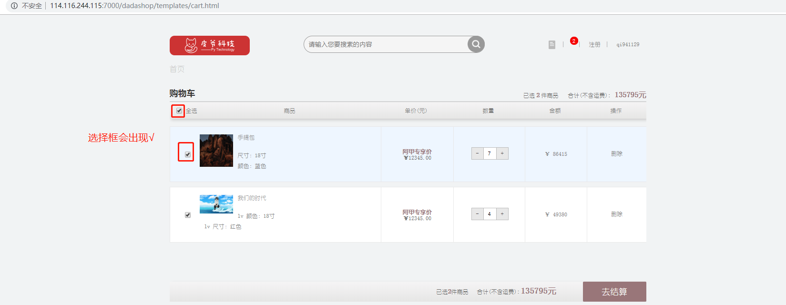


**URL**： 127.0.0.1:8000/v1/carts/<username>

**请求方式:** PUT

**请求参数**：JSON

| 参数   | 类型 | 是否必须 | 说明                   |
| ------ | ---- | -------- | ---------------------- |
| sku_id | int  | 是       | 购物车显示商品的sku_id |
| state  | str  | 是       | 判断事件状态           |

```python
#请求示例 
{'sku_id':1001,state:'select'}
```

**返回值**：JSON

**响应格式**

```python
# 正常响应： 
{"code":200,"data":skus_list}

# 异常响应
{"code":xxx,"error"：xxxx}
```

| 字段  | 含义     | 类型 | 备注                            |
| ----- | -------- | ---- | ------------------------------- |
| code  | 状态码   | int  | 默认正常为200，异常见状态码参考 |
| data  | 具体数据 | dict | 与error二选一                   |
| error | 错误信息 | char | 与data二选一                    |

skus_list参数信息

| 参数               | 类型    | 是否必须 | 说明                             |
| ------------------ | ------- | -------- | -------------------------------- |
| id                 | int     | 是       | 商品sku_id                       |
| name               | str     | 是       | 商品名称                         |
| count              | int     | 是       | 商品数量                         |
| default_image_url  | str     | 是       | 商品默认图片路径                 |
| price              | decimal | 是       | 商品单价                         |
| sku_sale_attr_name | list    | 是       | 商品属性                         |
| sku_sale_attr_val  | list    | 是       | 商品属性值                       |
| selected           | int     | 是       | 商品的选中状态（0未选中，1选中） |

```python
#sku_list中数据示例 [{"id":"","name":"","count":"","selected":"","default_image_url":"","price":"","sku_sale_attr_na me":[],"sku_sale_attr_val":[]},{"":""...}]
```

状态码参考

| 状态码 | 响应信息   | 原因短语         |
| ------ | ---------- | ---------------- |
| 200    | 正常       | OK               |
| 30101  | 未找到商品 | SKU query error  |
| 30104  | 未找到用户 | User query error |

#### 后端代码

```python
redis_conn = get_redis_connection('cart')

class CartVIew(View):
    @logging_check
    def put(self, request, username):
        cart_dict = json.loads(request.body)
        state = cart_dict.get('state')
        user = request.user
        if user.username != username:
            return JsonResponse({'code': 30104, 'error': '非登录者用户'})
        
         # 判断是否勾选
        if state == 'select' or state == 'unselect':
            sku_id = cart_dict.get('sku_id')
            # 勾选
            if state == 'select':
                skus_list = self.set_select_unselect(user.id, sku_id, 1)
                return JsonResponse({'code': 200, 'data': skus_list})

    def set_select_unselect(self, user_id, sku_id, selected):
        '''
        put 请求的state 状态 select 和  unselect
        :param user_id: 用户id user.id
        :param sku_id: 商品id int sku_id
        :param selected: 状态码（0/1)
        :return: 响应列表 [{"id":"","name":"","count":"","selected":""},{"":""...}]
        '''
        redis_c = redis_conn.hget('cart_%d' % user_id, sku_id)
        if not redis_c:
            return JsonResponse({'code': 30101, 'error': '未找到商品'})
        count = int(json.loads(redis_c)['count'])
        status = json.dumps({'count': count, 'selected': selected})
        redis_conn.hset('cart_%d' % user_id, sku_id, status)
        skus_list = self.get_cart_list(user_id)
        return skus_list
```


### 7.购物车商品取消单选

#### 事件触发

页面名：**cart.html** 

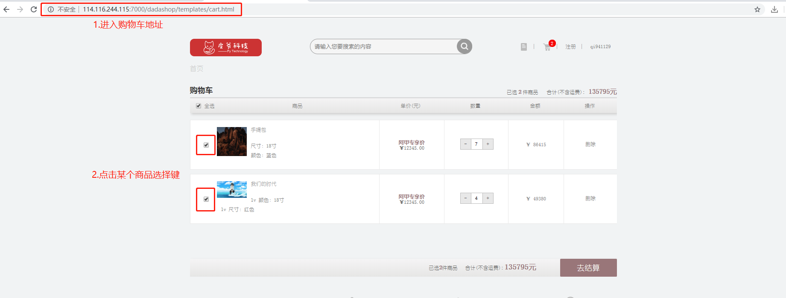

#### 触发结果

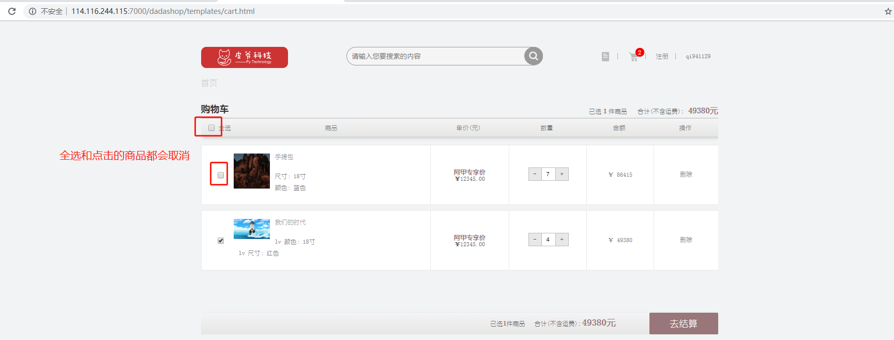


**URL**： 127.0.0.1:8000/v1/carts/<username>

**请求方式**: PUT

**请求参数**：JSON

| 参数   | 类型 | 是否必须 | 说明                   |
| ------ | ---- | -------- | ---------------------- |
| state  | str  | 是       | 判断事件状态           |
| sku_id | int  | 是       | 购物车显示商品的sku_id |

```python
#请求示例 
{'sku_id':1001,state:'unselect'}
```

**返回值**:JSON

**响应格式**:

```python
# 正常响应： 
{"code":200,"data":skus_list}

# 异常响应
{"code":xxx,"error"：xxxx}
```

| 字段  | 含义     | 类型 | 备注                            |
| ----- | -------- | ---- | ------------------------------- |
| code  | 状态码   | int  | 默认正确为200，异常见状态码参考 |
| data  | 具体数据 | dict | 与error二选一                   |
| error | 错误信息 | char | 与data二选一                    |

skus_list参数信息

| 参数               | 类型    | 是否必须 | 说明                             |
| ------------------ | ------- | -------- | -------------------------------- |
| id                 | int     | 是       | 商品sku_id                       |
| name               | str     | 是       | 商品名称                         |
| count              | int     | 是       | 商品数量                         |
| default_image_url  | str     | 是       | 商品默认图片路径                 |
| price              | decimal | 是       | 商品单价                         |
| sku_sale_attr_name | list    | 是       | 商品属性                         |
| sku_sale_attr_val  | list    | 是       | 商品属性值                       |
| selected           | int     | 是       | 商品的选中状态（0未选中，1选中） |

```python
#sku_list中数据示例 [{"id":"","name":"","count":"","selected":"","default_image_url":"","price":"","sku_sale_attr_na me":[],"sku_sale_attr_val":[]},{"":""...}]
```

状态码参考

| 状态码 | 响应信息   | 原因短语         |
| ------ | ---------- | ---------------- |
| 200    | 正常       | OK               |
| 30101  | 未找到商品 | SKU query error  |
| 30104  | 未找到用户 | User query error |

#### 后端代码

```python
redis_conn = get_redis_connection('cart')

class CartVIew(View):
    @logging_check
    def put(self, request, username):
        cart_dict = json.loads(request.body)
        state = cart_dict.get('state')
        user = request.user
        if user.username != username:
            return JsonResponse({'code': 30104, 'error': '非登录者用户'})

        if state == 'select' or state == 'unselect':
            sku_id = cart_dict.get('sku_id')
            # 取消勾选
            if state == 'unselect':
                skus_list = self.set_select_unselect(user.id, sku_id, 0)
                return JsonResponse({'code': 200, 'data': skus_list})
            
            
    def set_select_unselect(self, user_id, sku_id, selected):
        '''
        put 请求的state 状态 select 和  unselect
        :param user_id: 用户id user.id
        :param sku_id: 商品id int sku_id
        :param selected: 状态码（0/1)
        :return: 响应列表 [{"id":"","name":"","count":"","selected":""},{"":""...}]
        '''
        redis_c = redis_conn.hget('cart_%d' % user_id, sku_id)
        if not redis_c:
            return JsonResponse({'code': 30101, 'error': '未找到商品'})
        count = int(json.loads(redis_c)['count'])
        status = json.dumps({'count': count, 'selected': selected})
        redis_conn.hset('cart_%d' % user_id, sku_id, status)
        skus_list = self.get_cart_list(user_id)
        return skus_list

    
    
```

### 8.购物车商品全选

#### 事件触发

页面名：**cart.html** 

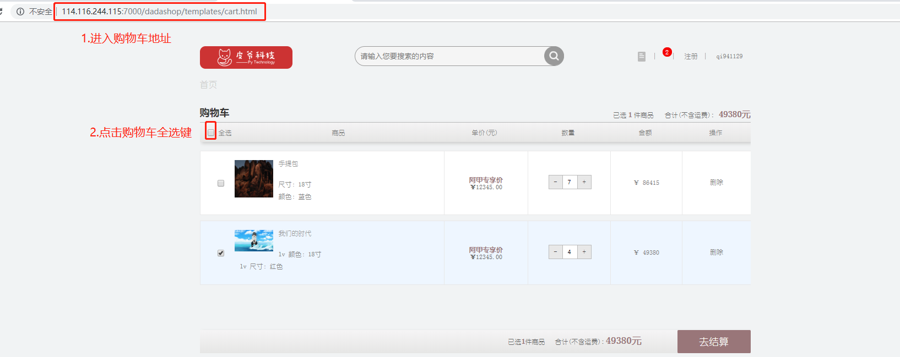

#### 触发结果

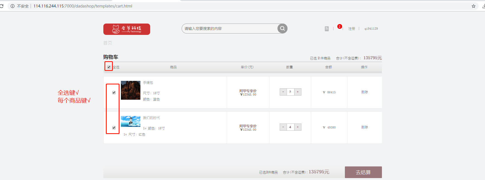


**URL**： 127.0.0.1:8000/v1/carts/<username>

**请求方式:** PUT

**请求参数**：JSON

| 参数  | 类型 | 是否必须 | 说明         |
| ----- | ---- | -------- | ------------ |
| state | str  | 是       | 判断事件状态 |

```
#请求示例： 
{state:'selectall'}
```

**返回值**：JSON

**响应格式**

```python
# 正常响应： 
{"code":200,"data":skus_list}

# 异常响应
{"code":xxx,"error"：xxxx}
```

| 参数               | 类型    | 是否必须 | 说明                             |
| ------------------ | ------- | -------- | -------------------------------- |
| id                 | int     | 是       | 商品sku_id                       |
| name               | str     | 是       | 商品名称                         |
| count              | int     | 是       | 商品数量                         |
| default_image_url  | str     | 是       | 商品默认图片路径                 |
| price              | decimal | 是       | 商品单价                         |
| sku_sale_attr_name | list    | 是       | 商品属性                         |
| sku_sale_attr_val  | list    | 是       | 商品属性值                       |
| selected           | int     | 是       | 商品的选中状态（0未选中，1选中） |

```python
#sku_list中数据示例 [{"id":"","name":"","count":"","selected":"","default_image_url":"","price":"","sku_sale_attr_na me":[],"sku_sale_attr_val":[]},{"":""...}]
```

状态码参考

| 状态码 | 响应信息   | 原因短句         |
| ------ | ---------- | ---------------- |
| 200    | 正常       | OK               |
| 30104  | 未找到用户 | User query error |

#### 后端代码

```python
redis_conn = get_redis_connection('cart')

class CartVIew(View):
    @logging_check
    def put(self, request, username):
        cart_dict = json.loads(request.body)
        state = cart_dict.get('state')
        user = request.user
        if user.username != username:
            return JsonResponse({'code': 30104, 'error': '非登录者用户'})

 	    # 判断是否全选
        if state == 'selectall' or state == 'unselectall':
            if state == 'selectall':
                skus_list = self.set_selectall_unselectall(user.id, 1)
                return JsonResponse({'code': 200, 'data': skus_list})

            
    def set_selectall_unselectall(self, user_id, selected):
        '''
        put 请求的state 状态selectall 和 unselectall
        :param user_id: 用户id user.id
        :param selected: 状态码（0/1)
        :return: 响应列表 [{"id":"","name":"","count":"","selected":""},{"":""...}]
        '''
        cart_all = redis_conn.hgetall('cart_%d' % user_id)
        if not cart_all:
            return JsonResponse({'code': 30101, 'error': '未找到商品'})
        for sku_id in cart_all.keys():
            cart_c = redis_conn.hget('cart_%d' % user_id, sku_id)
            count = int(json.loads(cart_c)['count'])
            status = json.dumps({'count': count, 'selected': selected})
            redis_conn.hset('cart_%d' % user_id, sku_id, status)
        skus_list = self.get_cart_list(user_id)
        return skus_list
    
    
```


### 9 购物车商品取消全选

#### 事件触发

页面名：**cart.html** 

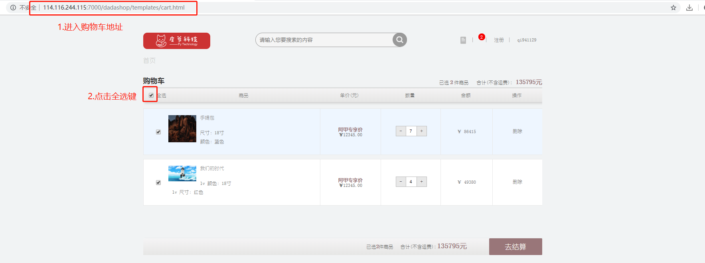

#### 触发结果

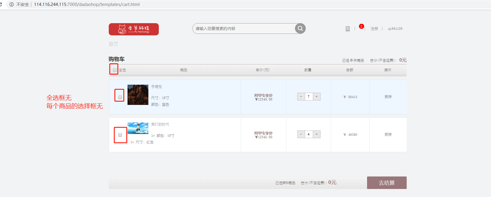


**URL**： 127.0.0.1:8000/v1/carts/<username>

**请求方式**: PUT

**请求参数**：JSON

| 参数  | 类型 | 是否必须 | 说明         |
| ----- | ---- | -------- | ------------ |
| state | str  | 是       | 判断事件状态 |

```
#请求示例 
{state:'unselectall'}
```

**返回值**：JSON

**响应格式**：

```python
# 正常响应： 
{"code":200,"data":skus_list}

# 异常响应
{"code":xxx,"error"：xxxx}
```

| 字段 | 含义     | 类型 | 备注                            |
| ---- | -------- | ---- | ------------------------------- |
| code | 状态码   | int  | 默认正常为200，异常见状态码参考 |
| data | 具体数据 | dict | 与error二选一                   |
| erro | 错误信息 | char | 与data二选一                    |

skus_list参数信息

| 参数               | 类型    | 是否必须 | 说明                            |
| ------------------ | ------- | -------- | ------------------------------- |
| id                 | int     | 是       | 商品sku_id                      |
| name               | str     | 是       | 商品名称                        |
| count              | int     | 是       | 商品数量                        |
| default_image_url  | str     | 是       | 商品默认图片路径                |
| price              | decimal | 是       | 商品单价                        |
| sku_sale_attr_name | list    | 是       | 商品属性                        |
| sku_sale_attr_val  | list    | 是       | 商品属性值                      |
| selected           | int     | 是       | 商品的选中状态（0未选中,1选中） |

```python
#sku_list中数据示例 [{"id":"","name":"","count":"","selected":"","default_image_url":"","price":"","sku_sale_attr_na me":[],"sku_sale_attr_val":[]},{"":""...}]
```

状态码参考

| 状态码 | 响应信息   | 原因短语         |
| ------ | ---------- | ---------------- |
| 200    | 正常       | OK               |
| 30104  | 未找到用户 | User query error |

#### 后端代码

```python
redis_conn = get_redis_connection('cart')

class CartVIew(View):
    @logging_check
    def put(self, request, username):
        cart_dict = json.loads(request.body)
        state = cart_dict.get('state')
        user = request.user
        if user.username != username:
            return JsonResponse({'code': 30104, 'error': '非登录者用户'})
        
	    # 判断是否全选
        if state == 'selectall' or state == 'unselectall':
            if state == 'unselectall':
                skus_list = self.set_selectall_unselectall(user.id, 0)
                return JsonResponse({'code': 200, 'data': skus_list})
            
            
    def set_selectall_unselectall(self, user_id, selected):
        '''
        put 请求的state 状态selectall 和 unselectall
        :param user_id: 用户id user.id
        :param selected: 状态码（0/1)
        :return: 响应列表 [{"id":"","name":"","count":"","selected":""},{"":""...}]
        '''
        cart_all = redis_conn.hgetall('cart_%d' % user_id)
        if not cart_all:
            return JsonResponse({'code': 30101, 'error': '未找到商品'})
        for sku_id in cart_all.keys():
            cart_c = redis_conn.hget('cart_%d' % user_id, sku_id)
            count = int(json.loads(cart_c)['count'])
            status = json.dumps({'count': count, 'selected': selected})
            redis_conn.hset('cart_%d' % user_id, sku_id, status)
        skus_list = self.get_cart_list(user_id)
        return skus_list
    
    
```

### 10.合并购物车

登陆模块会调用合并购物车函数

#### 触发事件

页面名：**cart.html** 

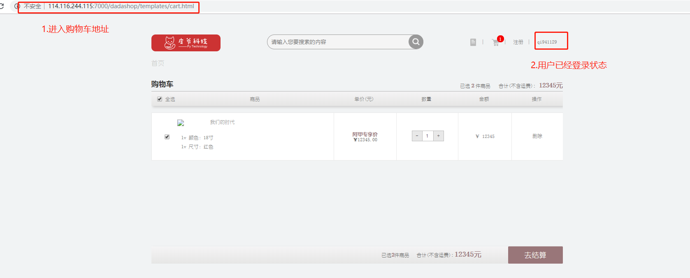

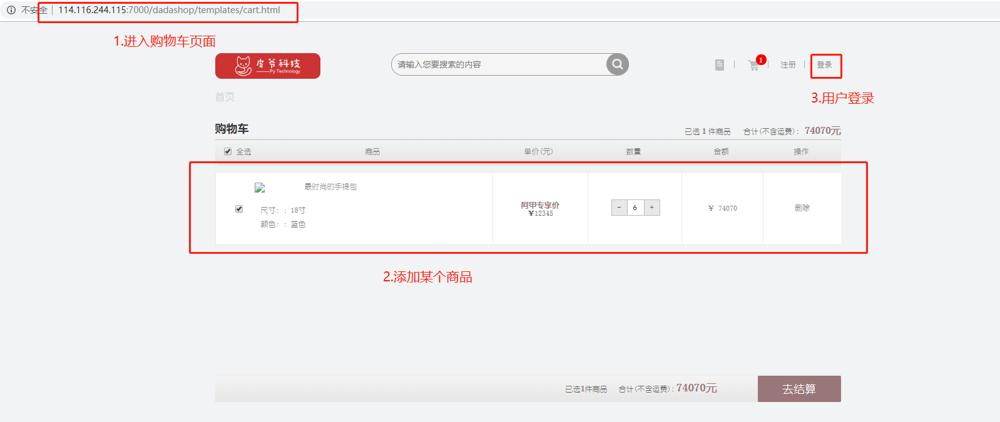

#### 触发结果

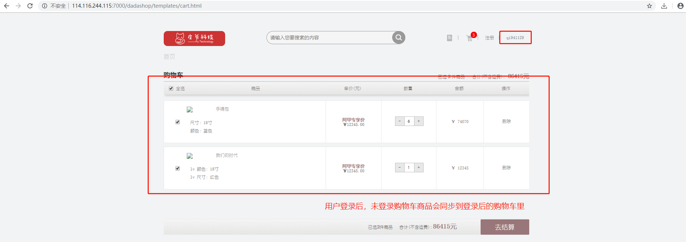


**请求参数**：JSON

| 参数   | 类型 | 是否必须 | 说明     |
| ------ | ---- | -------- | -------- |
| sku_id | str  | 是       | 商品id   |
| count  | int  | 是       | 商品数量 |

**响应格式**：

```json

{'code': 200, 'username': user.username, 'data': {'token': token.decode(),'len':cart_len}}
```

| 字段     | 含义     | 类型 | 备注          |
| -------- | -------- | ---- | ------------- |
| code     | 状态码   | int  | 默认正常为200 |
| username | 用户名   | char | 必选          |
| data     | 具体数据 | dict | 必选          |

参数信息

| 参数     | 类型 | 是否必须 | 说明             |
| -------- | ---- | -------- | ---------------- |
| token    | char | 是       | token令牌        |
| len      | int  | 是       | 购物车里数据长度 |
| username | char | 是       | 用户名           |

状态码参考

| 状态码 | 响应信息 | 原因短语 |
| ------ | -------- | -------- |
| 200    | 正常     | OK       |

#### 后端代码

```python
def merge_cart(user,token,cart_data):
    cart_cookie = cart_data
    user = user
    #判断如果未登录购物车为空
    if not cart_cookie:
        cart_dict = get_redis_connection('cart')
        cart_len = cart_dict.hlen('cart_%d' % user.id)
        response = {'code': 200, 'username': user.username, 'data': {'token': token.decode(), 'len': cart_len}}
        return JsonResponse(response)

    for c_dic in cart_cookie:
        sku_id= c_dic['id']
        c_count = int(c_dic['count'])
        redis_cli = get_redis_connection('cart')
        skuid = redis_cli.hgetall('cart_%d'%user.id)
        if sku_id.encode() in skuid.keys():
            status = redis_cli.hget('cart_%d'%user.id,sku_id)
            count = int(json.loads(status.decode())['count'])
            count = max(c_count,count)
            status = json.dumps({'count':count,'selected':1})
            redis_cli.hset('cart_%d' % user.id, sku_id,status)
        else:
            status = json.dumps({'count':c_count, 'selected': 1})
            redis_cli.hset('cart_%d' % user.id, sku_id, status)

    cart_dict = get_redis_connection('cart')
    cart_len = cart_dict.hlen('cart_%d' % user.id)
    response = {'code': 200, 'username': user.username, 'data': {'token': token.decode(),'len':cart_len}}
    # 返回响应对象，最终返回给浏览器
    return JsonResponse(response)
```

