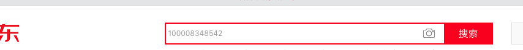
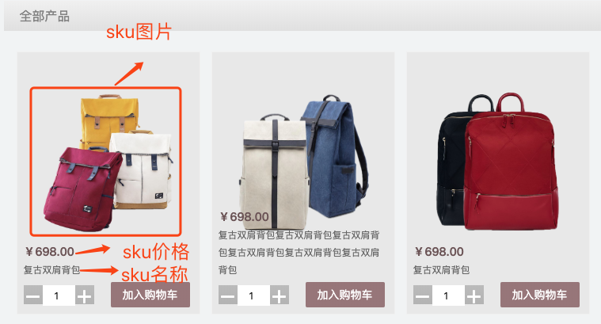

## 商品模块

### 一. SKU 和 SPU

一个电商系统，SPU、SKU等设计的好坏，影响到后面的开发进度，以及架构的调整等。而 SPU、SKU又是一个电商系统的核心，我们一起参考淘宝设计来讲清楚什么是 SPU、SKU。


SPU，是 standard product unit，标准化产品单元，是商品信息聚合的最小单位，属性值、特性相同的商品就可以成为一个SPU。在淘宝中你可能看不到 spu 这个概念，淘宝商品都拥有商品 ID(item design)，其实就是 spu。不像京东，直接来个 spuId = xxx 这样的直观。


SKU，全称 stock keeping unit，库存量单位。SKU 是用来定价和管理库存的。例如：7 Plus 有很多颜色，很多配置，每个颜色和配置的组合都会形成新的产品，这时就产生很多 SKU，SKU 在传统线下行业也是一个非常常用的概念，尤其是服装行业，同款不同尺码不同色都是独立的 SKU，需要有独立的条形码，独立的库存管理等。


下面我们一起来看看淘宝中的 SPU 和 SKU，加深大家的认识。

当我们在浏览器里访问：https://detail.tmall.com/item.htm?id=525248995106&skuId=4225910992958 和 https://detail.tmall.com/item.htm?id=525248995106&skuId=4225910992962 时，会看到两款不同的商品，这就是 SPU。每款商品中有不同的颜色，规格，尺寸等代表的就是 SKU。


以 https://detail.tmall.com/item.htm?id=525248995106&skuId=4225910992961 为例，当我们选择不同的颜色后，浏览器地址栏中的 skuId 就会跟着变化。选择不同的颜色，价格和库存都会跟着变化，这就是 SKU 决定了一个商品的价格和库存。


上面的 id 就对应着一个 SPU，一个 SPU 可以有多个 SKU。SPU 用来区分品种，一般商家用来统计某个品种的销量。比如，A 商家统计 iphone 8 销量，就是 SPU 的维度来统计的。也可以从 SKU 的方向来统计，比如：A 商家统计 iphone 8 中黑色64G的销量。

京东和淘宝还是有区别的，京东的商品详情页链接是直接挂着skuid的，url例如：

https://item.jd.com/100008348542.html


在url的后半部分就挂着一个skuid，我们可以直接根据这个skuid 100008348542 在首页进行搜索，搜索的结果会直接跳到该商品详情页，这一点是和淘宝天猫的区别。




如果还是不理解，大家都去过超市买东西，到收银台的时候，收银员手里有一个扫码枪，她会一个一个的扫你购买的商品上条形码。这个条形码就对应一个 SKU，一个 SKU 对应一个条形码，因为每一个条形码对应一个价格和库存。


### 二. 表结构设计以及models


#### 1. 表结构设计

 [商品部分表结构设计.html](商品部分表结构设计.html)  


#### 


#### 2. models编写

根据之前设计好的表结构来写models.py文件

```python
from django.db import models


class Catalog(models.Model):
    """
    商品类别
    """
    create_time = models.DateTimeField(auto_now_add=True, verbose_name="创建时间")
    update_time = models.DateTimeField(auto_now=True, verbose_name="更新时间")
    name = models.CharField(max_length=10, verbose_name='类别名称')

    class Meta:
        db_table = 'DDSC_GOODS_CATALOG'
        verbose_name = '商品类别'
        verbose_name_plural = verbose_name

    def __str__(self):
        return self.name


class Brand(models.Model):
    """
    品牌
    """
    create_time = models.DateTimeField(auto_now_add=True, verbose_name="创建时间")
    update_time = models.DateTimeField(auto_now=True, verbose_name="更新时间")
    name = models.CharField(max_length=20, verbose_name='商品名称')
    logo = models.ImageField(verbose_name='Logo图片')
    first_letter = models.CharField(max_length=1, verbose_name='品牌首字母')

    class Meta:
        db_table = 'DDSC_BRAND'
        verbose_name = '品牌'
        verbose_name_plural = verbose_name

    def __str__(self):
        return self.name


class SPU(models.Model):
    create_time = models.DateTimeField(auto_now_add=True, verbose_name="创建时间")
    update_time = models.DateTimeField(auto_now=True, verbose_name="更新时间")
    name = models.CharField(max_length=50, verbose_name='名称')
    sales = models.IntegerField(default=0, verbose_name='商品销量')
    comments = models.IntegerField(default=0, verbose_name='评价数量')
    brand = models.ForeignKey(Brand, on_delete=models.PROTECT, verbose_name='品牌')
    catalog = models.ForeignKey(Catalog, on_delete=models.PROTECT, related_name='catalog_goods', verbose_name='商品类别')

    class Meta:
        db_table = 'DDSC_SPU'
        verbose_name = 'SPU'
        verbose_name_plural = verbose_name

    def __str__(self):
        return self.name


class SPUSaleAttr(models.Model):
    """
    SPU销售属性表
    """
    create_time = models.DateTimeField(auto_now_add=True, verbose_name="创建时间")
    update_time = models.DateTimeField(auto_now=True, verbose_name="更新时间")
    SPU_id = models.ForeignKey(SPU, on_delete=models.CASCADE, verbose_name='SPU')
    sale_attr_name = models.CharField(max_length=20, verbose_name='SPU属性名称')

    class Meta:
        db_table = 'DDSC_SPU_SALE_ATTR'
        verbose_name = 'SPU销售属性'
        verbose_name_plural = verbose_name

    def __str__(self):
        return '%s' % (self.sale_attr_name)

class SKU(models.Model):
    """
    SKU
    """
    create_time = models.DateTimeField(auto_now_add=True, verbose_name="创建时间")
    update_time = models.DateTimeField(auto_now=True, verbose_name="更新时间")
    name = models.CharField(max_length=50, verbose_name='SKU名称')
    caption = models.CharField(max_length=100, verbose_name='副标题')
    SPU_ID = models.ForeignKey(SPU, on_delete=models.CASCADE, verbose_name='商品')
    price = models.DecimalField(max_digits=10, decimal_places=2, verbose_name='单价')
    cost_price = models.DecimalField(max_digits=10, decimal_places=2, verbose_name='进价')
    market_price = models.DecimalField(max_digits=10, decimal_places=2, verbose_name='市场价')
    stock = models.IntegerField(default=0, verbose_name='库存')
    sales = models.IntegerField(default=0, verbose_name='销量')
    comments = models.IntegerField(default=0, verbose_name='评价数')
    is_launched = models.BooleanField(default=True, verbose_name='是否上架销售')
    default_image_url = models.ImageField(verbose_name='默认图片',default=None)

    class Meta:
        db_table = 'DDSC_SKU'
        verbose_name = 'SKU表'
        verbose_name_plural = verbose_name

    def __str__(self):
        return '%s: %s' % (self.id, self.name)
    
    
class SaleAttrValue(models.Model):
    """
    销售属性值表
    """
    create_time = models.DateTimeField(auto_now_add=True, verbose_name="创建时间")
    update_time = models.DateTimeField(auto_now=True, verbose_name="更新时间")
    sale_attr_id = models.ForeignKey(SPUSaleAttr, on_delete=models.CASCADE, verbose_name='销售属性id')
    sku = models.ForeignKey(SKU, on_delete=models.CASCADE, verbose_name='sku', default='')
    sale_attr_value_name = models.CharField(max_length=20, verbose_name='销售属性值名称')

    class Meta:
        db_table = 'DDSC_SALE_ATTR_VALUE'
        verbose_name = '销售属性值'
        verbose_name_plural = verbose_name

    def __str__(self):
        return '%s - %s' % (self.sale_attr_id, self.sale_attr_value_name)


class SKUImage(models.Model):
    """
    SKU图片
    """
    create_time = models.DateTimeField(auto_now_add=True, verbose_name="创建时间")
    update_time = models.DateTimeField(auto_now=True, verbose_name="更新时间")
    sku_id = models.ForeignKey(SKU, on_delete=models.CASCADE, verbose_name='sku')
    image = models.ImageField(verbose_name='图片路径')

    class Meta:
        db_table = 'DDSC_SKU_IMAGE'
        verbose_name = 'SKU图片'
        verbose_name_plural = verbose_name

    def __str__(self):
        return '%s %s' % (self.sku_id.name, self.id)


class SPUSpec(models.Model):
    """
    SPU规格表
    """
    create_time = models.DateTimeField(auto_now_add=True, verbose_name="创建时间")
    update_time = models.DateTimeField(auto_now=True, verbose_name="更新时间")
    spu = models.ForeignKey(SPU, on_delete=models.CASCADE, verbose_name='SPU')
    spec_name = models.CharField(max_length=20, verbose_name='SPU规格名称')

    class Meta:
        db_table = 'DDSC_SPU_SPEC'
        verbose_name = 'SPU规格'
        verbose_name_plural = verbose_name

    def __str__(self):
        return '%s: %s' % (self.spu.name, self.spec_name)


class SKUSpecValue(models.Model):
    """
    SKU规格属性表
    """
    create_time = models.DateTimeField(auto_now_add=True, verbose_name="创建时间")
    update_time = models.DateTimeField(auto_now=True, verbose_name="更新时间")
    sku = models.ForeignKey(SKU, on_delete=models.CASCADE, verbose_name='sku')
    spu_spec = models.ForeignKey(SPUSpec, on_delete=models.CASCADE, verbose_name='SPU规格名称')
    name = models.CharField(max_length=20, verbose_name='SKU规格名称值')

    class Meta:
        db_table = 'DDSC_SKU_SPEC_VALUE'
        verbose_name = 'SKU规格属性值表'
        verbose_name_plural = verbose_name

    def __str__(self):
        return '%s: %s: %s' % (self.sku, self.spu_spec.spec_name, self.name)
```


### 三. 首页展示


#### 1. 接口设计

接口设计遵循 restful 设计模式，在 dashop 下的url：

```python
urlpatterns = [
    url(r'^admin/', admin.site.urls),
    url(r'^v1/goods', include('goods.urls')),
]
```

在 goods app 下的商城首页展示 url 设计：

```python
urlpatterns = [
    url(r'^/index$', views.GoodsIndexView.as_view()),
]
```


#### 2. 细节说明

首页展示主要是根据 catalog 来展示，在每个 catalog 分类下展示其中三个 sku，需要展示每个 sku 的***名称，副标题，价格，图片***等信息。与此同时还需要展示 ***catalog 名称***。


可以根据 catalog 查询到该分类下的 spu，之后再根据 spu 查询到所需的 sku。

```python
# 1.获取指定分类的 spu
spu_ids = SPU.objects.filter(catalog=cata.id).values("id")
# 2.获取指定 spu 下的 sku
sku_list = SKU.objects.filter(SPU_ID__in=spu_ids, is_launched=True)
```


##### 注意：在做首页展示的时候，必须保证每个 catalog 下至少有三个 sku 的数据，否则页面显示异常。


#### 3. 代码说明

```python
class GoodsIndexView(View):
    def get(self, request):
        """
        首页商品及分类项展示

        商城默认有三个品类：
        名称         id
        拉杆箱        101
        背包         102
        手提包       103
        :param result:
        :return:
        """
        # 127.0.0.1:8000/v1/goods/index
        # 0. 获取所有品类
        catalog_list = Catalog.objects.all()

        # 1. 获取各个catalog下的三条sku数据，首页每个品类下面默认显示三个sku
        index_data = []
        # 从redis中获取所有数据
        redis_conn = get_redis_connection('goods')
        redis_index  = redis_conn.get('index_cache')
        if redis_index is None:
            print("未使用缓存")
            for cata in catalog_list:
                catalog_dic = {}
                catalog_dic["catalog_id"] = cata.id
                catalog_dic["catalog_name"] = cata.name
                # 1.1 获取拉杆箱sku
                spu_ids = SPU.objects.filter(catalog=cata.id).values("id")
                sku_list = SKU.objects.filter(SPU_ID__in=spu_ids, is_launched=True)[:3]
                catalog_dic["sku"] = []
                for sku in sku_list:
                    sku_dict = dict()
										"""
										此处填充sku_dict字典......
										"""
                    catalog_dic["sku"].append(sku_dict)
                index_data.append(catalog_dic)
                # 写入缓存
            redis_conn.set("index_cache", json.dumps(index_data))
        else:
            print("使用缓存")
            index_data = json.loads(redis_index)
        result = {"code": 200, "data": index_data, "base_url": PIC_URL}

        return JsonResponse(result)
```


### 四. 列表页展示


#### 1. 接口设计

接口设计遵循 restful 设计模式，在 dashop 下的url：

```python
urlpatterns = [
    url(r'^admin/', admin.site.urls),
    url(r'^v1/goods', include('goods.urls')),
]
```

在 goods app 下的列表页展示 url 设计：

```python
urlpatterns = [
    # 需要传入 catalog_id，因为分类是根据类别的 id 去区分的
    url(r'^/catalogs/(?P<catalog_id>\d+)', views.GoodsListView.as_view()),
]
```


#### 2. 细节说明

分类是根据sku在列表页会显示该分类下的所有 sku，此处的图片为 sku 表中的 default_image_url




**Django 中的分页功能**

Django 提供了一个新的类来帮助你管理分页数据，这个类存放在`django/core/paginator.py`.它可以接收列表、元组或其它可迭代的对象。项目的列表展示中运用到了分页功能，是使用 ***Paginator*** 实现的。下面是Paginator 的具体使用方式：

```python
import os
# 导入模块
from django.core.paginator import Paginator
data_list = ['a', 'b', 'c', 'd', 'e', 'f', 'g', 'h', 'i', 'j']
p = Paginator(data_list, 3)  # 3条数据为一页，实例化分页对象
print(p.count)  # 10 对象总共10个元素
print(p.num_pages)  # 4 对象可分4页
print(p.page_range)  # range(1, 5)对象页的可迭代范围
 
page1 = p.page(1)  # 取对象的第一分页对象
print(page1.object_list)  # 第一分页对象的元素列表['a', 'b', 'c']
print(page1.number)  # 第一分页对象的当前页值 1
 
page2 = p.page(2)  # 取对象的第二分页对象
print(page2.object_list)  # 第二分页对象的元素列表 ['d', 'e', 'f']
print(page2.number)  # 第二分页对象的当前页码值 2
 
print(page1.has_previous())  # 第一分页对象是否有前一页 False
print(page1.has_other_pages())  # 第一分页对象是否有其它页 True
 
print(page2.has_previous())  # 第二分页对象是否有前一页 True
print(page2.has_next())  # 第二分页对象是否有下一页 True
print(page2.next_page_number())  # 第二分页对象下一页码的值 3
print(page2.previous_page_number())  # 第二分页对象的上一页码值 1
print(page2.start_index())  # 第二分页对象的元素开始索引 4
print(page2.end_index())  # 第2分页对象的元素结束索引 6
```

我们给前端传递数据的时候，要实现分页功能，只需要传递每一页显示多少条数据 pagesize ，以及总共的记录数 total 即可。


#### 3. 代码说明

```python
class GoodsListView(View):
    def get(self, request, catalog_id):
        """
        获取列表页内容
        :param request:
        :param catalog_id: 分类id
        :param page_num: 第几页
        :param page_size: 每页显示多少项
        :return:
        """
        # 127.0.0.1:8000/v1/goods/catalogs/1/?launched=true&page=1
        # 0. 获取url传递参数值
        launched = bool(request.GET.get('launched', True))
        page_num = request.GET.get('page', 1)
        # 1.获取分类下的sku列表
        ......
        
        # 2.分页
        # 创建分页对象，指定列表、页大小
        page_num = int(page_num)
        page_size = 9
        try:
            paginator = Paginator(sku_list, page_size)
            # 获取指定页码的数据
            page_skus = paginator.page(page_num)
            page_skus_json = []
            for sku in page_skus:
                sku_dict = dict()
                """
                填充sku......
                """
                page_skus_json.append(sku_dict)
        except:
            result = {'code': 40200, 'error': '页数有误，小于0或者大于总页数'}
            return JsonResponse(result)
        result = {'code': 200, 'data': page_skus_json, 'paginator':{'pagesize':page_size, 'total': len(sku_list)}, 'base_url': PIC_URL}
        return JsonResponse(result)
```


### 五. 详情页展示


#### 1. 接口设计

接口设计遵循 restful 设计模式，在 dashop 下的url：

```python
urlpatterns = [
    url(r'^admin/', admin.site.urls),
    url(r'^v1/goods', include('goods.urls')),
]
```

在 goods app 下的商城首页展示 url 设计：

```python
urlpatterns = [
    url(r'^/detail/(?P<sku_id>\d+)$', views.GoodsDetailView.as_view()),
]
```


#### 2. 细节说明

详情页展示，展示的是每个 sku 下的具体信息，所以需要参数 sku_id。

这里需要传递的数据有：

1. 类别的id，类别的名称
2. sku的名称，sku的副标题，sku的id，sku的图片
3. spu的销售属性id以及名称以及销售属性值id以及名称


这里还有个需要注意的地方，就是 sku 销售属性值高亮显示的问题，当我们打开一个详情页的时候，必然是所有的属性已经有了该 sku 的所有销售属性值，并将该 sku 的属性值高亮显示，所以我们还需要从 SKUSaleAttrValue  和 SaleAttrValue 表中拿到 sku 销售属性值的id和name，将数据交给前端进行比较，从而高亮显示：


至于切换在详情页切换 sku 的功能会在后续说到。

在详情页下半部分还有需要注意的地方就是商品规格部分和详情页大图部分：


与规格相关的两张表是 SPUSpec 以及 SKUSpecValue 表，与详情大图挂钩的是 SKUImage 表。

规格的归属单位是 SPU，而具体的规格属性是根据不同的 SKU 来决定的。

```python
# sku规格部分
# 用于存放规格相关数据，格式：{规格名称1: 规格值1, 规格名称2: 规格值2, ...}
spec = dict()
sku_spec_values = SKUSpecValue.objects.filter(sku=sku_id)
if not sku_spec_values:
    sku_details['spec'] = dict()
else:
    for sku_spec_value in sku_spec_values:
        spec[sku_spec_value.spu_spec.spec_name] = sku_spec_value.name
    sku_details['spec'] = spec
```


在详情页使用到了 redis 做数据缓存，作用是如果在指定时间内请求访问同一个 sku 下的数据时，直接从缓存中拿数据，减轻数据库压力。


#### 3. 代码说明

```python
class GoodsDetailView(View):
    def get(self, request, sku_id):
        """
        获取sku详情页信息，获取图片暂未完成
        :param request:
        :param sku_id: sku的id
        :return:
        """
        # 127.0.0.1:8000/v1/goods/detail/401/
        # 1. 获取sku实例
        sku_details = {}
        # 从redis中获取所有数据
        redis_conn = get_redis_connection('goods')
        redis_detail = redis_conn.get('goods_%s' % sku_id)
        if redis_detail is None:
            print("未使用缓存")
            try:
                sku_item = SKU.objects.get(id=sku_id)
            except:
                # 1.1 判断是否有当前sku
                result = {'code': 40300, 'error': "Such sku doesn' exist", }
                return JsonResponse(result)
            sku_catalog = sku_item.SPU_ID.catalog
            """
            填充 sku_details ......
            """
           

            # 详情图片
            sku_image = SKUImage.objects.filter(sku_id=sku_item.id)
            if sku_image:
                sku_details['detail_image'] = str(sku_image[0].image)
            else:
                sku_details['detail_image'] = ""

            # 2. 获取sku销售属性名称和sku销售属性值
            sku_sale_attrs_val_lists = SaleAttrValue.objects.filter(sku=sku_id)
            sku_sale_attr_val_names = [] # 保存sku销售属性值名称的list
            sku_sale_attr_val_id = []
            sku_sale_attr_names = [] # 保存sku销售属性名称的list
            sku_sale_attr_id = []
            sku_all_sale_attr_vals_name = {}
            sku_all_sale_attr_vals_id = {}

            # 传递sku销售属性id和名称  以及  sku销售属性值id和名称
            for sku_sale_attrs_val in sku_sale_attrs_val_lists:
                sku_sale_attr_val_names.append(sku_sale_attrs_val.sale_attr_value_name)
                sku_sale_attr_val_id.append(sku_sale_attrs_val.id)
                sku_sale_attr_names.append(sku_sale_attrs_val.sale_attr_id.sale_attr_name)
                sku_sale_attr_id.append(sku_sale_attrs_val.sale_attr_id.id)
                # 该销售属性下的所有属性值，供·页面选择使用
                # SPU销售属性：颜色，容量
                # 页面显示：
                # 颜色： 红色，蓝色
                # 容量：100ml，200ml
                # 返回数据包含：
                #   1. spu销售属性id，即颜色，容量两个属性的id
                #   2. spu销售属性名称
                #   3. 销售属性值id，即 红色id为1，蓝色id为2，100ml的id为3，200ml的id为4
                #   4. 销售属性值名称
                #   5. sku销售属性值id及名称
                attr = SPUSaleAttr.objects.get(id=sku_sale_attrs_val.sale_attr_id.id)
                sku_all_sale_attr_vals_id[attr.id] = []
                sku_all_sale_attr_vals_name[attr.id] = []
                vals = SaleAttrValue.objects.filter(sale_attr_id=attr.id)
                for val in vals:
                    print("attr.id:", attr.id)
                    print("val.id:", val.id, val.sale_attr_value_name)
                    sku_all_sale_attr_vals_name[int(attr.id)].append(val.sale_attr_value_name)
                    sku_all_sale_attr_vals_id[int(attr.id)].append(val.id)
                    print(sku_all_sale_attr_vals_name,sku_all_sale_attr_vals_id )
            sku_details['sku_sale_attr_id'] = sku_sale_attr_id
            sku_details['sku_sale_attr_names'] = sku_sale_attr_names
            sku_details['sku_sale_attr_val_id'] = sku_sale_attr_val_id
            sku_details['sku_sale_attr_val_names'] = sku_sale_attr_val_names
            sku_details['sku_all_sale_attr_vals_id'] = sku_all_sale_attr_vals_id
            sku_details['sku_all_sale_attr_vals_name'] = sku_all_sale_attr_vals_name

            # sku规格部分
            # 用于存放规格相关数据，格式：{规格名称1: 规格值1, 规格名称2: 规格值2, ...}
            spec = dict()
            sku_spec_values = SKUSpecValue.objects.filter(sku=sku_id)
            if not sku_spec_values:
                sku_details['spec'] = dict()
            else:
                for sku_spec_value in sku_spec_values:
                    spec[sku_spec_value.spu_spec.spec_name] = sku_spec_value.name
                sku_details['spec'] = spec

            # 写入缓存
            redis_conn.setex("goods_%s" % sku_id, 60*60*24, json.dumps(sku_details))
        else:
            print("使用缓存")
            sku_details = json.loads(redis_detail)

        result = {'code': 200, 'data': sku_details, 'base_url': PIC_URL}
        return JsonResponse(result)
```


### 六. 搜索功能


#### 1. 接口设计

接口设计遵循 restful 设计模式，在 dashop 下的url：

```python
urlpatterns = [
    url(r'^admin/', admin.site.urls),
    url(r'^v1/goods', include('goods.urls')),
]
```

在 goods app 下的商城首页展示 url 设计：

```python
urlpatterns = [
    url(r'^/search$', views.GoodsSearchView.as_view()),
]
```


#### 2. 细节说明

搜索功能使用了 Elasticsearch 搜索引擎。


#### 3. 代码说明

```python
class GoodsSearchView(View):
    def post(self,request, load_all=True, searchqueryset=None):
        """
        首页查询功能
        :param request:
        :return:
        """
        # 127.0.0.1:8000/v1/goods/search/
        from dadashop.settings import HAYSTACK_SEARCH_RESULTS_PER_PAGE
        query = ''
        page_size = HAYSTACK_SEARCH_RESULTS_PER_PAGE
        results = EmptySearchQuerySet()
        if request.POST.get('q'):
            form = ModelSearchForm(request.POST, searchqueryset=searchqueryset, load_all=load_all)
            if form.is_valid():
                query = form.cleaned_data['q']
                results = form.search()
        else:
            form = ModelSearchForm(searchqueryset=searchqueryset, load_all=load_all)

        paginator = Paginator(results, page_size)
        try:
            page = paginator.page(int(request.POST.get('page', 1)))
        except:
            result = {'code': 40200, 'error': '页数有误，小于0或者大于总页数'}
            return JsonResponse(result)

        # 记录查询信息
        context = {
            'form': form,
            'page': page,
            'paginator': paginator,
            'query': query,
        }

        sku_list = []
        # print(len(page.object_list))
        for result in page.object_list:
            sku = {
                'skuid': result.object.id,
                'name': result.object.name,
                'price': result.object.price,
            }
            # 获取图片
            sku_image = str(result.object.default_image_url)
            sku['image'] = sku_image
            sku_list.append(sku)
        result = {"code": 200, "data": sku_list, 'paginator': {'pagesize': page_size, 'total': len(results)}, 'base_url': PIC_URL}
        return JsonResponse(result)
```


### 七. 详情页 SKU 切换功能


#### 1. 功能设计

根据修改 SKU 的销售属性值确定出不同的sku，进而修改详情页的展示数据。


#### 2. 代码展示

```python
class GoodsChangeSkuView(View):
    def post(self, request):
        data = json.loads(request.body)
        # 将前端传来的销售属性值id放入列表
        sku_vals = []
        result = {}
        for k in data:
            if 'spuid' != k:
                sku_vals.append(data[k])
        sku_list = SKU.objects.filter(SPU_ID=data['spuid'])

        for sku in sku_list:
            sku_details = dict()
            sku_details['sku_id'] = sku.id
            # 获取sku销售属性值id
            sale_attrs_val_lists = SaleAttrValue.objects.filter(sku=sku.id)
            sale_attr_val_id = []

            for sale_attrs_val in sale_attrs_val_lists:
                sale_attr_val_id.append(sale_attrs_val.id)

            if sku_vals == sale_attr_val_id:
                result = {"code": 200, "data": sku.id,}
        if len(result) == 0:
            result = {"code": 40050, "error": "no such sku",}
        return JsonResponse(result)
```


### 八. 商品上架以后后台管理功能


#### 1. 功能设计

我们将商品上架功能放到 admin 中来实现，需要分别对商品部分的十张表进行不同的操作，进而实现商品上架。上面首页展示提到本地缓存管理，意思是如果后台数据有变化的情况，我们需要清空缓存，否则会出现数据显示异常的情况，可以跟进 Django 的源码进行分析（打断点，debug），最后得出所有的修改和删除的保存都是调用了 ModelAdmin 中的 save_model 和 delete_model 这两个方法，根据这个条件进行修改。

我们需要管理的缓存包括首页数据缓存和详情页数据缓存两部分。

首页页缓存可以直接根据 **index_cache** 删除：redis_conn.delete('index_cache')

详情页缓存则需要根据具体的 sku 进行删除：redis_conn.delete("goods_%s" % sku的id)


**第一种方案：**

在 admin.py 中的每一个继承 admin.ModelAdmin 的类中重写 save_model 和 delete_model 这两个方法：

```python
@admin.register(Catalog)
class CatalogAdmin(admin.ModelAdmin):
  
    # 重写 save_model 方法做到清除缓存
    def save_model(self, request, obj, form, change):
        super().save_model(request, obj, form, change)
        # 删除首页缓存
        redis_conn.delete('index_cache')
        print("保存数据时，首页缓存删除")
        
		# 重写 delete_model 方法做到清除缓存
    def delete_model(self, request, obj):
        super().delete_model(request, obj)
        # 删除首页缓存
        redis_conn.delete('index_cache')
        print("删除数据时，首页缓存删除")
       
    list_display = ['id', 'name']

    # list_per_page设置每页显示多少条记录，默认是100条
    list_per_page = 20

    # ordering设置默认排序字段，创建时间降序排序
    ordering = ('create_time',)
```

这种方案有一个弊端就是要在所有的类中重写这两个方法，代码复用性不高而且麻烦，于是有第二种方案。


**第二种方案：**

在 admin.py 中定义一个类 BaseModel，让这个类继承自 admin.ModelAdmin 类，并重写 save_model 和 delete_model 这两个方法，让 CatalogAdmin 等都继承 BaseModel。

```python
class BaseModel(admin.ModelAdmin):
    """
    继承admin.ModelAdmin
    重写save_model / delete_model 方法
    """
    def save_model(self, request, obj, form, change):
        super().save_model(request, obj, form, change)
        # 删除首页缓存
        redis_conn.delete('index_cache')
        print("保存数据时，首页缓存删除")

    def delete_model(self, request, obj):
        super().delete_model(request, obj)
        # 删除首页缓存
        redis_conn.delete('index_cache')
        print("删除数据时，首页缓存删除")


@admin.register(Brand)
class BrandAdmin(BaseModel):
    list_display = ['id', 'name']

    # list_per_page设置每页显示多少条记录，默认是100条
    list_per_page = 20

    # ordering设置默认排序字段，创建时间降序排序
    ordering = ('create_time',)
```


#### 2. admin模块代码（可拓展）展示：

```python
from django.contrib import admin
from .models import *
from django_redis import get_redis_connection


redis_conn = get_redis_connection("goods")


class BaseModel(admin.ModelAdmin):
    """
    继承admin.ModelAdmin
    重写save_model / delete_model 方法
    """
    def save_model(self, request, obj, form, change):
        super().save_model(request, obj, form, change)
        # 删除首页缓存
        redis_conn.delete('index_cache')
        print("保存数据时，首页缓存删除")

    def delete_model(self, request, obj):
        super().delete_model(request, obj)
        # 删除首页缓存
        redis_conn.delete('index_cache')
        print("删除数据时，首页缓存删除")


@admin.register(Brand)
class BrandAdmin(BaseModel):
    list_display = ['id', 'name']

    # list_per_page设置每页显示多少条记录，默认是100条
    list_per_page = 20

    # ordering设置默认排序字段，创建时间降序排序
    ordering = ('create_time',)


@admin.register(Catalog)
class CatalogAdmin(BaseModel):
    list_display = ['id', 'name']

    # list_per_page设置每页显示多少条记录，默认是100条
    list_per_page = 20

    # ordering设置默认排序字段，创建时间降序排序
    ordering = ('create_time',)


@admin.register(SPU)
class SPUAdmin(BaseModel):

    list_display = ['id', 'name', 'catalog']

    # list_per_page设置每页显示多少条记录，默认是100条
    list_per_page = 20

    # ordering设置默认排序字段，创建时间降序排序
    ordering = ('create_time',)

    # fk_fields 设置显示外键字段
    fk_fields = ('catalog',)

    search_fields = ('name', )  # 搜索字段


@admin.register(SPUSaleAttr)
class SPUSaleAttrAdmin(BaseModel):

    list_display = ['id', 'SPU_id', 'sale_attr_name']

    # list_per_page设置每页显示多少条记录，默认是100条
    list_per_page = 20

    # ordering设置默认排序字段，创建时间降序排序
    ordering = ('create_time',)

    # fk_fields 设置显示外键字段
    fk_fields = ('SPU_id',)

    search_fields = ('sale_attr_name',)  # 搜索字段


@admin.register(SKU)
class SKUAdmin(BaseModel):

    def save_model(self, request, obj, form, change):
        super().save_model(request, obj, form, change)
        redis_conn.delete('index_cache')
        redis_conn.delete("goods_%s" % obj.id)
        print("保存数据时，首页缓存删除，详情页缓存删除")

    def delete_model(self, request, obj):
        super().delete_model(request, obj)
        # 删除首页缓存
        redis_conn.delete('index_cache')
        redis_conn.delete("goods_%s" % obj.id)
        print("保存数据时，首页缓存删除，详情页缓存删除")

    list_display = ['id', 'name', 'SPU_ID', 'is_launched',]
    # list_per_page设置每页显示多少条记录，默认是100条
    list_per_page = 20

    # ordering设置默认排序字段，创建时间降序排序
    ordering = ('create_time',)

    # fk_fields 设置显示外键字段
    fk_fields = ('SPU_id',)

    search_fields = ('name',)  # 搜索字段


@admin.register(SaleAttrValue)
class SaleAttrValueAdmin(BaseModel):

    def save_model(self, request, obj, form, change):
        super().save_model(request, obj, form, change)
        # 删除详情页缓存
        redis_conn.delete("goods_%s" % obj.sku.id)
        print("sku.id", obj.sku.id)
        print("保存数据时，详情页缓存清除")

    def delete_model(self, request, obj):
        super().delete_model(request, obj)
        # 删除详情页缓存
        redis_conn.delete("goods_%s" % obj.sku.id)
        print("保存数据时，详情页缓存清除")

    list_display = ['id', 'sku', 'sale_attr_value_name', 'sale_attr_id',]
    # list_per_page设置每页显示多少条记录，默认是100条
    list_per_page = 20

    # ordering设置默认排序字段，创建时间降序排序
    ordering = ('create_time',)

    # fk_fields 设置显示外键字段
    fk_fields = ('sale_attr_id', 'sku')

    search_fields = ('sale_attr_value_name',)  # 搜索字段

@admin.register(SKUImage)
class SKUImageAdmin(BaseModel):

    def save_model(self, request, obj, form, change):
        super().save_model(request, obj, form, change)
        # 删除详情页缓存
        redis_conn.delete("goods_%s" % obj.sku_id.id)
        print("sku.id", obj.sku_id.id)
        print("保存数据时，详情页缓存清除")

    def delete_model(self, request, obj):
        super().delete_model(request, obj)
        # 删除详情页缓存
        redis_conn.delete("goods_%s" % obj.sku_id.id)
        print("保存数据时，详情页缓存清除")

    list_display = ['id', 'sku_id', 'image',]
    # list_per_page设置每页显示多少条记录，默认是100条
    list_per_page = 20

    # ordering设置默认排序字段，创建时间降序排序
    ordering = ('create_time',)

    # fk_fields 设置显示外键字段
    fk_fields = ('sku_id',)


@admin.register(SPUSpec)
class SPUSpecAdmin(BaseModel):

    list_display = ['id', 'spu', 'spec_name']

    # list_per_page设置每页显示多少条记录，默认是100条
    list_per_page = 20

    # ordering设置默认排序字段，创建时间降序排序
    ordering = ('create_time',)

    # fk_fields 设置显示外键字段
    fk_fields = ('spu',)

    search_fields = ('spec_name',)  # 搜索字段


@admin.register(SKUSpecValue)
class SKUSpecValueAdmin(BaseModel):

    def save_model(self, request, obj, form, change):
        super().save_model(request, obj, form, change)
        # 删除详情页缓存
        redis_conn.delete("goods_%s" % obj.sku.id)
        print("sku.id", obj.sku.id)
        print("保存数据时，详情页缓存清除")

    def delete_model(self, request, obj):
        super().delete_model(request, obj)
        # 删除详情页缓存
        redis_conn.delete("goods_%s" % obj.sku.id)
        print("保存数据时，详情页缓存清除")

    list_display = ['id', 'sku', 'spu_spec', 'name']

    # list_per_page设置每页显示多少条记录，默认是100条
    list_per_page = 20

    # ordering设置默认排序字段，创建时间降序排序
    ordering = ('create_time',)

    # fk_fields 设置显示外键字段
    fk_fields = ('sku', 'spu_spec')

    search_fields = ('spec_name',)  # 搜索字段

```

