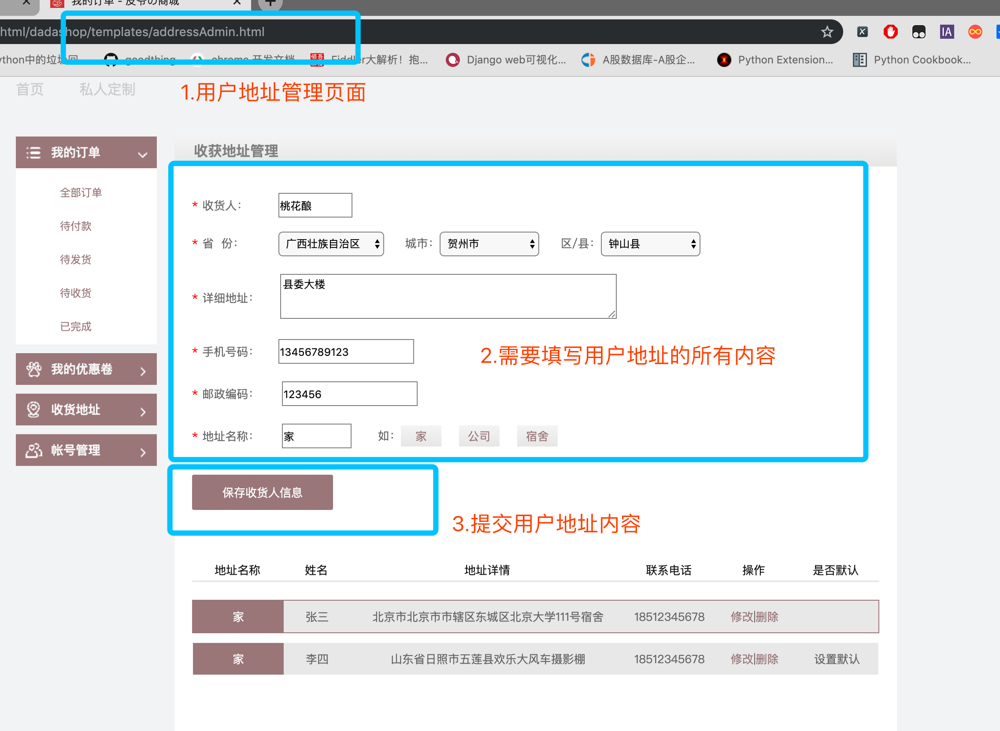
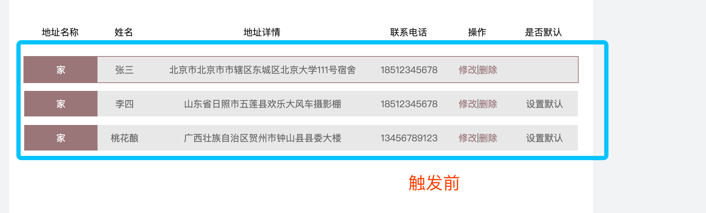

# 用户模块-接口说明

# 一.用户模块概述：	

​		用户模块主要提供对于是用户使用本产品的基础。用户模块提供以下功能：

>找回密码
>
>修改密码
>
>用户激活
>
>用户收获地址新增/修改/删除/设为默认
>

# 二.事件定义

## 找回密码

​		用户在登陆页可以通过点击找回密码按钮来实现找回密码功能，主要分为三步。首先通过用户发送注册时的邮箱，此时会向邮箱中发送一份关于找回密码的验证码，此验证码会有时效。通过输入对应的验证码，验证没问题之后，显示设置新密码界面，提交之后就可以使用新密码进行登录。

##修改密码

​		修改密码功能需要在登录情况下进行，在个人账号管理页面中选择，需要输入旧密码以及新密码。通过ajax进行与后端交互。如果用户正确修改密码之后，则需要重新登陆。

## 用户激活

​		用户在注册的同时会同步发送用户激活的邮件。此激活邮件中存在用户激活的链接，用户通过点击此链接之后，在此页面内进行跳转到激活页面，此页面中有两个按钮，是否激活。用户点击激活之后，通过ajax发送激活请求。进行激活。

##用户地址

​	地址查询功能：在用户访问到地址页面时，此时会发送用户绑定的地址请求，全量返回有效的用户地址。

​	增加地址功能：用户可以提交新增地址，包括收货人、收件地址、地址标签、以及用户的联系方式，通过ajax提交。如果正常存储的话，此时回全量返回用户绑定的地址。

​	修改地址功能：用户可以修改有效地址中的收件人、收件地址、练习方式、以及地址标签。提交成功的话，回全量返回用户的地址。

​	删除地址功能：用户可以在界面上触发删除地址按钮，此时会将地址的ID通过ajax传入到后台，通过设置该地址的活跃属性来实现删除功能，此功能也是全量返回，然后通过渲染进行在前端展示。

​	设为默认地址：用户可以将任意一个非默认地址改为默认地址。通过ajax提交到后端，此功能提交的是地址的ID，将此ID的地址设置为默认，同时将此用户的其他地址ID设为非默认。然后进行全量返回。进行渲染。

# 三.API 说明

## 修改密码

 在登录的状态下才能够修改用户登录密码。

#### 事件触发：

页面名： **personal_password.html**


#### 触发结果：

​	触发成功：


​	触发失败：


修改密码API：

**URL**: `http://127.0.0.1:8000/v1/users/<username>/password`

**请求方法**：POST

**请求参数**：JSON

| 字段        | 含义     | 类型 | 备注 |
| ----------- | -------- | ---- | ---- |
| oldpassword | 旧密码   | char | 必填 |
| password1   | 新密码   | char | 必填 |
| password2   | 确认密码 | char | 必填 |

请求示例：

```json
{
  'oldpasword':'123456',
  'password1':'123321',
  'password2':'654321'
}
```

| 字段    | 含义                                     | 类型 | 备注                      |
| ------- | ---------------------------------------- | ---- | ------------------------- |
| code    | 状态                                     | int  | 默认正常为200。异常见附录 |
| error   | 错误信息                                 | dict | 与data二选一              |
| data    | 正确信息                                 | dict | 与error二选一             |
| message | 包含在正确信息或者错误信息中，为具体原因 | char | 存在于data或者error中     |

**返回值**：JSON

**响应格式**：

```json
# 正确示例
{
  'code':200,
  'data':'修改成功'
}
# 错误示例
{
  'code':xxx,
  'error':'error reason'
}
```

#### 后端代码逻辑：

```python
# BaseUserView 是一个公共调用的基础试图。里边封装的两个方法。

class BaseUserView(View):
    """
    此类是用来公共调用
    1.获取生成用户地址列表
    2.检查传递的参数
    """
    def get_address_list(self,alladdress):
        """
        对用户的地址进行序列化
        params : 返回所有地址query_set,进行遍历
        return : 地址列表，元素为每一条合法的地址
        """
        addresslist = []
        for values in alladdress:
            each_address = {}
            each_address['id'] = values.id
            each_address['address'] = values.address
            each_address['receiver'] = values.receiver
            each_address['receiver_mobile'] = values.receiver_mobile
            each_address['tag'] = values.tag
            each_address['is_default'] = values.default_address
            addresslist.append(each_address)
        return addresslist

    def check_args(self,data):
        """
        用来检查用户传递的数据。是否为空。
        params : 前端传递的数据，格式为字典。
        return : 如果检查没问题那么返回data字典
                 如果检查有问题，那么返回该有问题数据的键（str）
        """
        for key,value in data.items():
            if not value:
                return key
        return data


class ModifyPasswordView(BaseUserView):
    """
    用户登陆状态下 修改密码：
    http://127.0.0.1:8000/v1/user/<username>/password
    """
    # 检查用户是否登陆的装饰器
    @logging_check
    def post(self, request, username):
        """
        :param request:request 对象
        :return:  成功修改的状态
        """
        # 1.对用户传入的数据长度进行检查
        # 2.通过调用父类中的方法，来实现对于数据内容的检查
        # 3.判断用户新密码和旧密码
        # 4.判断新密码和确认密码
        # 5.通过用户名来找到该用户对象，拿到用户密码，进行验证
        # 6.修改用户密码
        # 7.返回修改成功状态
```

## 找回密码功能

**时序图**


###step1 发送邮箱验证请求：

#### 事件触发：

页面名： **findPass.html**


#### 触发结果：

邮箱中可以收到后台发送的邮箱验证码（10分钟之内有效）：


触发失败：


发送邮箱验证

**URL**：`http://127.0.0.1:8000/v1/users/password/sms`

**请求方法**：POST

**请求参数**：JSON

| 字段  | 含义 | 类型 | 备注             |
| ----- | ---- | ---- | ---------------- |
| email | 邮箱 | char | 通过邮箱找回密码 |

请求示例：

```json
{
	'email':xxxxx # 邮箱
}
```

响应数据

| 字段  | 含义         | 类型 | 备注          |
| ----- | ------------ | ---- | ------------- |
| code  | 状态吗       | int  | 必填          |
| data  | 返回数据     | dict | 与error二选一 |
| error | 返回错误原因 | char | 与data二选一  |

**返回值**：JSON

**响应格式**：

```json
# 正常响应
{
  'code':200,
  'data':"邮件发送成功",
}
# 异常响应
{
  'code':xxx,
  'error':'error reason'
}
```

#### 后端代码逻辑：

```python
class SendSmsCodeView(BaseUserView):
    """
    用户找回密码视图处理函数：
    分为三步：
    1.验证邮箱，并且发送邮件验证码
    2.验证邮件验证码，
    3.验证码验证成功，修改密码
    """
    def post(self, request):
       
		# TODO检查传入数据的长度
        # 1.验证用户邮箱是否正确。
        # 2.首先查询用户是否10分钟之内，已经发送过验证码，如果有的话，就返回成功状态。
        # 3.如果没有发送过，生成新的验证码，存入redis，将发送成功状态返回到前端
        # 3.5 通过celery发送异步消息。
```

### step2: 发送邮箱验证码

#### 事件触发：

页面名： **findPass.html**


#### 触发结果：

正常结果：


异常结果：


发送邮箱验证码：

**URL**：`http://127.0.01:8000/v1/users/password/verification/`

**请求方法**： POST

**请求参数**：JSON

| 字段  | 含义   | 类型 | 备注 |
| ----- | ------ | ---- | ---- |
| email | 邮箱   | char | 必填 |
| code  | 验证码 | char | 必填 |

```json
{
  'email':'xxxx',
  'code':'xxxx'
}
```

响应数据：

| 字段  | 含义           | 类型 | 备注          |
| ----- | -------------- | ---- | ------------- |
| code  | 响应状态吗     | char | 必填          |
| data  | 返回正常数据() | dict | 与error二选一 |
| error | 返回错误原因() | char | 与data二选一  |

**返回值**：JSON

**响应格式**：

```json
# 正常响应
{
  'code':200,
 	'data':'验证码通过'，
  'email’：‘xxxx’ # 返回邮箱
}
# 异常响应
{
  'code':xxx,
  'error':'error reason'
}
```

#### 后端代码逻辑：

```python
class VerifyCodeView(BaseUserView):
    """
    第二步 验证发送邮箱的验证码
    """
    def post(self, request):
        """
        验证用户邮箱验证码
        :param request:
        :param username: 用户名
        :return:
        """
        # 1. 检查前端传递的数据（邮箱和验证码）
        # 2. 获取redis中缓存验证码，和前端的进行校验
        # 3. 如果验证码一致，删除redis中的数据，返回正确状态，以及状态码，以及用户邮箱。
				# 4. 如果验证不一致，返回错误状态以及错误状态状态码。       
```

### step3 修改密码

#### 事件触发：

页面名： **findPass.html**


#### 触发结果：

正常响应


异常响应：


修改密码：

**URL**：`http://127.0.0.1:8000/v1/users/password/new`

**请求方法**：POST

**请求参数**：JSON

| 字段      | 含义     | 类型 | 备注 |
| --------- | -------- | ---- | ---- |
| email     | 邮箱     | char | 必填 |
| password1 | 新密码   | char | 必填 |
| Password2 | 确认密码 | char | 必填 |

请求i示例

```json
{
	"email":"xxx",    # 通过用户邮箱锁定用户
  'password1':'xxx' # 新密码
  'password2':'xxx' # 确认密码
}
```

响应数据：

| 字段    | 含义         | 类型 | 备注             |
| ------- | ------------ | ---- | ---------------- |
| code    | 响应状态码   | char | 必填             |
| data    | 返回正常数据 | dict | 与error二选一    |
| error   | 返回异常数据 | dict | 与data二选一     |
| message | 具体响应信息 | char | 正确或者错误原因 |

**返回值**：JSON

**响应格式**：

```json
# 正常数据
{
  'code':200,
  'data':'OK'
}
#  异常数据
{
  'code':xxx,
  'error':'error reason'
}
```

#### 后端代码逻辑：

```python
class ModifyPwdView(BaseUserView):
    """
    最后一步验证邮箱，修改密码
    """

    def post(self, request):
      	"""
      	用户重置密码第三步：
      	"""
        # 1. 获取用户传递的数据长度，以及是否有值，进行校验。
        # 2. 校验用户传递密码是否一致。
        # 3. 根据用户的邮箱来查询用户
        # 4. 校验新密码和旧密码是否相同
        # 5. 重置用户的密码。
```

## 邮箱验证激活功能

​		在用户注册时候，后台会给用户注册填写的邮箱发送一条激活的链接。通过点击链接跳转到达达商城的用户激活页面。通过激活来实现商城所有功能的体验。

#### 事件触发：

用户在注册时候会通过邮箱给用户发送一封激活邮件，然后用户通过点击链接，进行重定向到前端地址，此时通过js获取用户前端页面的查询字符串，进行激活。

页面名： **test_register.html**


#### 触发结果：

正常结果：


 跳转激活页面：

页面地址： **xxx/xxx/active.html**


异常结果：


**URL**：`http://127.0.0.1:8000/v1/users/activation?code=xxxx`

**请求方法**：GET

**请求参数**：JSON

| 字段 | 含义                           | 类型 | 备注 |
| ---- | ------------------------------ | ---- | ---- |
| code | 用户名和随机码base64编码字符串 | char | 必填 |

**返回值**：JSON

**响应格式**：

```json
# 正常响应
{
  'code': 200,
  'data': '激活成功'
}
# 异常响应
{
  'code':xxx,
  'error':'error_reason'
}
```

#### 后端代码逻辑：

```python
class ActiveView(View):
    """
    # 用户发送邮件激活
    # GET http://127.0.0.1:8000/v1/user/active?code=xxxxx
    """
    def get(self, request):
        """
        由于没有设置激活链接的参数的redis中的有效时间。
        在用户激活之后删除redis中缓存的激活链接
        """
        # 1. 通过查询字符串拿到用户传递的激活链接code
        # 2. 将传递的字符串进行base64进行反解，获取用户名和随机码
        # 3. 通过用户名获取用户邮箱
        # 4. 校验反解之后的邮箱和通过用户名获取的邮箱。
        # 5. 如果一致的话，将用户的激活状态改为True。返回修改成功以及成功状态码。
        # 6. 如果不一致，那么返回错误原因，以及错误状态码。
```

## 地址功能-增删改查设为默认

达达商城提供地址增删改查设为默认的功能：

​	查询功能：在用户请求的地址管理页面的时候，等页面主体加载完之后，会发送查询当前用户的绑定地址。返回当前用户绑定的所有地址。

​	增加地址功能：用户可以新增绑定地址。

​	修改地址功能：可以修改用户地址中的任何字段。

​	删除地址功能：可以删除用户所绑定的地址，不是真正的删除，而是在后台将地址改为非活跃的。

​	设为默认地址：用户可以将任意一个非默认地址改为默认地址。默认地址在用户完成付款之前会直接绑定到该订单上。


#### 地址增删改查接口


### 查询地址：

**URL**:`http://127.0.0.1:8000/v1/users/<username>address`

#### 事件触发：

页面名：**addressAdmin.html**


#### 触发结果：

​	正常响应：


​	异常响应：

​	如果用户没有登陆的访问到地址页面，此时会弹出用户登陆提示，然后跳到登陆页面。


**请求方法**：GET

返回数据：在访问页面的时候，返回当前用户的所有地址

**返回值**：JSON

**响应格式**：

```json
# 正常数据返回
{
  "code":200,
   "addresslist":[
      {
        'id':123456, # 地址id
        'address':'广东省深圳市龙华区嘉熙业广场1155室'， # 地址
        'receiver’：’达内科技‘， # 收货人
        'receiver_mobile‘：'12345678901', # 联系电话
        'tag':'家'，# 地址标签
        'postcode':'722494',  #
        'is_default':"True",
      },
      {
         'id':123457,
        'address':'广东省深圳市龙华区嘉熙业广场1142室'，
        'receiver’：’达内科技‘，
        'receiver_mobile‘：'12345678910',
        'tag':'公司'，
        'postcode':'722406',
        'is_default':"False",
      }
    ]
}
# 异常数据返回类型：
{
  'code': status_code,
  'error':'error_reason'
}
```

#### 后端代码逻辑：

```python
class AddressView(BaseUserView):
    """
    get: 获取用户的绑定的收获地址
    post: 新增用户绑定的收获地址
    delete：实现用户删除地址功能
    put: 实现用户修改地址功能
    """
    @logging_check
    def get(self, request, username):
        """
        返回用户关联的地址页面，以及地址
        :param request:
        :return: addressAdmin.html & addresslist
        """
        # 1.通过用户名来获取用户对象,拿到用户ID
        # 2.通过用户ID获取用户所有有效的地址
        # 3.将用户地址进行序列化，返回
```

### 新增地址：

#### 事件触发：



#### 触发结果：

​	正常结果：


​    异常结果：


**URL**:`http://127.0.0.1:8000/v1/users/<username>address`

**请求方法**：POST

**请求参数**：JSON

| 参数           | 参数类型  | 含义       | 备注 |
| -------------- | --------- | ---------- | ---- |
| receiver       | char(10)  | 收件人     | 必填 |
| receiver_phone | char(11)  | 收件人电话 | 必填 |
| address        | char(100) | 地址       | 必填 |
| postcode       | char(7)   | 邮编       | 必填 |
| tag            | char(10)  | 标签       | 必填 |

请求示例

```json
{
  'receiver':'小王'，
  ‘receiver_phone’:'18667018590',
  'address':'北京市东城区珠市口大街珍贝大厦2楼',
  'postcode':'722405',
  'tag':'公司'
}
```

**返回值**：JSON

**响应格式**：

```json
# 正常响应
{
  "code":200,
  "data":"新增地址成功！"
}
# 异常响应
{
  'code': status_code,
  'error':'error_reason'
}
```

#### 后端代码逻辑：

```python
    @logging_check
    def post(self, request, username):
        """
        用来提交保存用户的收获地址
        1.先获取相应的用户，然后根据用户的id来绑定地址
        :param request:
        :return:返回保存后的地址以及地址的id
        """
        # 1.对于用户传递的数据进行校验。
        # 2.根据用户名获取用户对象，通过用户对象获取用户ID。
        # 3.根据用户ID查询用户是否已经绑定地址了
        #    3.1 如果用户已经有绑定地址，保存用户地址，默认地址default为False
        #    3.2 如果用户没有绑定地址，那么该条地址数据要设置用户默认地址
        # 4. 保存成功之后，返回修改成功状态！
```

### 删除地址

#### 事件触发：

页面名：**addressAdmin.html**


#### 触发结果：

正常触发:




**URL**:`http://127.0.0.1:8000/v1/users/<username>address/<id>`

**请求方法**：DELETE

**请求参数**: JSON

| 参数     | 参数类型 | 含义   | 备注 |
| -------- | -------- | ------ | ---- |
| id       | char(10) | 地址ID | 必填 |
| username | char(11) | 用户名 | 必填 |

```json
{
  'id':'xxxxxx'
}
```

**返回值**：JSON

**响应格式**：

```json
# 正常响应
{
  "code":200,
   "data":"删除地址成功"
}
# 异常响应：
{
  'code':xxxx,
  'error':'error_reason'
}
```

#### 后端代码逻辑：

```python
    @logging_check
    def delete(self, request, username, id):
        """
         删除用户的提交的地址，此处删除并不是真正的删除，而是修改其状态。
         :param request: 提交的body中为用户的地址的id
         :param username:
         :return: 删除后用户的所有的收货地址
        """
        # 根据用户发来的地址的id来直接删除用户地址
        # 1. 根据用户传递的地址ID来筛选出此条地址。
        # 2. 将此条地址的is_alive值改为False即可。
        # 3. 返回删除成功的状态。
```

###修改地址：

#### 事件触发：

页面名：**addressAdmin.html**


#### 触发结果：

正常响应


异常响应


**URL**:`http://127.0.0.1:8000/v1/users/<username>address/<id>`

**请求方式**：PUT

**请求参数**：JSON

| 参数           | 参数类型  | 含义       | 备注 |
| -------------- | --------- | ---------- | ---- |
| tag            | char(10)  | 地址标签   | 必填 |
| receiver_phone | char(11)  | 收件人电话 | 必填 |
| receiver       | char(7)   | 收件人姓名 | 必填 |
| Address        | char(100) | 收件人地址 | 必填 |

请求示例：

```json
{
  'receiver':'校长',
  'receiver_phone':'18667018590'，
  'address':'广东省深圳市龙华区民治大道100号',
  'tag':'公司',
}
```

**返回值**：JSON

**响应格式**：

```json
# 正常响应
{
  "code":200,
  "data":"地址修改成功！"
}

# 异常响应
{
    "code": xxx,
     'error':'error_reason'
}
```

####后端代码逻辑：

```python
    @logging_check
    def put(self, request, username, id):
        """
        根据用户传递过来的收货地址来修改相应的内容
        :param request: 用户请求的对象
        :param address_id:用户地址id
        :return: 返回修改之后的地址的全部内容
        """
        # 1.根据用户传递的地址的ID来获取用户此条地址。
        # 2.获取用户传递的地址的修改数据。
        # 3.将该条地址的所有数据根据用户传递的数据重新赋值。
        # 4.返回修改成功状态！
```

### 设为默认：

#### 事件触发：

页面名：**addressAdmin.html**


#### 触发结果：

正常触发


**URL**：`http://127.0.0.1:8000/v1/users/address/<username>/default`

请求类型：**POST**

| 参数 | 参数类型 | 含义   | 备注 |
| ---- | -------- | ------ | ---- |
| id   | char(10) | 地址ID | 必填 |

请求示例

```json
{
  'id':'xxxxxxx'
}
```

**返回值**：JSON

**响应格式**：

```json
# 正常响应
{
  "code":200,
  "data":"设为默认成功！"
}
# 异常响应
{
  'code':xxx,
  'error':'error_reason'
}
```

#### 后端代码逻辑：

```python
class DefaultAddressView(BaseUserView):
    """
    用来修改默认地址
    """
    @logging_check
    def post(self, request, username):
        """
        用来修改默认地址
        :param request:用户请求对象
        :param address_id:用户修改地址的id
        :return:
        """
        # 1.先根据address_id 来匹配出用户的id
        # 2.筛选出用户的所有有效地址。
        # 3.遍历所有的地址，将地址ID和当前的ID一样的地址default设置为True。其他的改为False。
        # 4.返回修改成功状态！   
```

### 附录：用户模块异常状态码参考：

| 状态码 |          响应信息          |                       原因短语                        |
| :----: | :------------------------: | :---------------------------------------------------: |
|  200   |            正常            |                          OK                           |
| 10100  |          无效参数          |                  Invalid parameters                   |
| 10101  | 无法获取用户名，需要登陆。 |                  User not logged in                   |
| 10102  |  设置新密码两次输入不一致  |                Inconsistent passwords                 |
| 10103  |         旧密码错误         |                  Old password error                   |
| 10104  |        用户查询出错        |                   User query error                    |
| 10105  |       存储验证码失败       |          Storage authentication code failed           |
| 10106  |   验证码失效，请重新发送   | The validation code is invalid. Please send it again. |
| 10107  |     无法获取用户旧密码     |            Unable to retrieve old password            |
| 10108  |         无效的密码         |              Please enter your password               |
| 10109  |        确认密码有误        |        Confirm that the password is incorrect         |
| 10110  |       两次密码不一致       |               Password Inconsistencies                |
| 10111  |         旧密码错误         |                  Old password error!                  |
| 10112  |        验证链接失效        |     Verify that the link is invalid and resend it     |
| 10113  |      激活链接参数有误      |           Error activating link parameters            |
| 10114  |        地址查询出错        |                Error in Address Query                 |
| 10115  |        无效的收件人        |                  invalid recipients                   |
| 10116  |         无效的地址         |                    Invalid address                    |
| 10117  |       无效的电话号码       |                 Invalid phone number                  |
| 10118  |         无效的邮编         |                   Invalid postcode                    |
| 10119  |       无效的地址标签       |                     Invalid  tag                      |
| 10120  |        地址存储异常        |               Address storage exception               |
| 10121  |        地址查询异常        |                 Get address exception                 |
| 10122  |       无法获取地址ID       |                 Get address id error                  |
| 10123  |      修改地址参数有误      |       Error in address modification parameters        |
| 10124  |     无法获取微博登陆页     |               Cant get weibo login page               |
| 10125  |     无法获取微博token      |               Unable to get weibo token               |
| 10126  |         无效的邮箱         |                     Invalid email                     |
| 10127  |        无效的用户名        |                   Invalid username                    |
| 10128  |        创建用户失败        |                  Create user failed                   |
| 10129  |      无效的微博token       |                 Invalid access token                  |
| 10130  |        关联微博失败        |                Related to weibo failed                |
| 10131  |        无效的手机号        |                 Invalid phone number                  |
|  201   |   微博账号未绑定本地用户   |                   access_token used                   |
| 10131  |          重复请求          |                   Repeated requests                   |
| 10132  |       获取验证码异常       |                   Verify Code Error                   |
| 10133  |        新旧密码重复        |                Use Different Password                 |
| 10134  |        无法获取用户        |                    Can't get User                     |

## Celery-消息任务队列

 Celery 是一个 基于python开发的分布式异步消息任务队列，通过它可以轻松的实现任务的异步处理， 在我们这个项目中会用到使用celery进行发送用户的 **邮箱激活邮件**、**短信验证码**、**邮箱验证码**:

- 你想对100台机器执行一条批量命令，可能会花很长时间 ，但你不想让你的程序等着结果返回，而是给你返回 一个任务ID,你过一段时间只需要拿着这个任务id就可以拿到任务执行结果， 在任务执行ing进行时，你可以继续做其它的事情。
- 你想做一个定时任务，比如每天检测一下你们所有客户的资料，如果发现今天 是客户的生日，就给他发个短信祝福。

Celery 在执行任务时需要通过一个消息中间件来接收和发送任务消息，以及存储任务结果， 一般使用rabbitMQ 或者Redis,本项目中主要使用redis。

**Celery有以下优点：**

- 简单：一旦熟悉了celery的工作流程后，配置和使用还是比较简单的。
- 高可用：当任务执行失败或执行过程中发生连接中断，celery 会自动尝试重新执行任务。
- 快速：一个单进程的celery每分钟可处理上百万个任务。
- 灵活： 几乎celery的各个组件都可以被扩展及自定制。

### 工作原理


### 基于redis实现的Celery

- 安装Celery：
  `pip3 install celery`
- 后台启动redis服务
  `redis-server`

### 创建celery任务文件夹

在此使用的通过创建一个独立的包来实现celery。在Django项目的内部，把celery_tasks当作一个独立的包进行使用，在保重有主模块和任务模块。

```python
celery_tasks
  |
  |----main.py   # 主模块
  |---- user_tasks.py  # 任务执行模块
```

#### settings.py

```json

CACHES += {
  	# 所有的验证有关的参数都存在redis 2号数据库。
    "verify_email": {
        "BACKEND": "django_redis.cache.RedisCache",
        "LOCATION": "redis://127.0.0.1:6379/2",
        "OPTIONS": {
            "CLIENT_CLASS": "django_redis.client.DefaultClient",
        }
    },
}
# redis相关配置
# 官网定义的变量名:
# https://docs.celeryproject.org/en/latest/userguide/configuration.html#task-result-backend-settings
BROKER_URL = 'redis://127.0.0.1/14'
CELERY_RESULT_BACKEND = 'redis://127.0.0.1/15'

```

#### main.py

```python
# -*- coding:utf-8 -*-
import os
from celery import Celery

# 读取Django中的配置信息去启动
if not os.getenv('DJANGO_SETTINGS_MODULE'):
    os.environ['DJANGO_SETTINGS_MODULE'] = 'dadashop.settings'


celery_app = Celery('dadashop')
# 导入celery配置
celery_app.config_from_object('celery_tasks.settings')
# 自动注册celery任务，每一个任务注册到任务列表中
celery_app.autodiscover_tasks(['celery_tasks.user_tasks'])
```

#### users_tasks.py

将所有的任务写到同一个函数中，根据sendtype的不同来选择不同的发送类型任务

```python
# -*- coding:utf-8 -*-
from celery_tasks.main import celery_app
from django.core.mail import send_mail
from django.conf import settings
from utils.SendTemplateSMS import send_template_SMS


@celery_app.task(name='send_verify')
def send_verify(email=None, code=None, email_code=None, phone=None, verify_url=None, sendtype=None):
    """
    发送邮件
    :param receiver : 收件人，code 邮箱验证码
    :return:None
    发送类型为0：  则发送邮箱验证码。
    发送类型为1：  则发送邮箱激活链接
    发送类型为2：  则发送短信验证码
    """
    if sendtype == 0:
        # 发送类型为1的时候，发送密码找回邮件。
    elif sendtype == 1:
        # 发送类型为1的时候，发送邮箱激活链接
    elif sendtype == 2:
        # 发送类型为2的时候。发送短信验证码
```

#### 解释说明：

在不同的好事任务中我们只需要调用相应的函数的时候加上  **函数名.delay(*args,\*\*kwarg)**,就可以通过celery来执行相应的任务。

例如：

```python
# first
class SendSmsCodeView(View):
    """
    用户找回密码视图处理函数：
    分为三步：
    1.验证邮箱，并且发送邮件验证码
    2.验证邮件验证码，
    3.验证码验证成功，修改密码
    """

    def post(self, request, username):
        data = request.POST
        email = data.get('email', None)
       	......
        ......
        # 在此处调用发送邮箱验证码
        send_verify.delay(email=email, email_code=email_code, sendtype=0)
        return JsonResponse({'code': 200, 'data': 'OK'})

# second
class Users(View):
  
    def post(self, request):
				...
        ...
        
        # 发送用户激活链接
        # 此链接是通过用户名和邮箱中间拼接了/
        code = "%d" % random.randint(1000, 9999)
        code_str = code + '/' + username
        # 生成激活链接：
        active_code = base64.urlsafe_b64encode(code_str.encode(encoding='utf-8')).decode('utf-8')
        redis_conn = get_redis_connection('verify_email')
        # TODO : 用户激活链接永久有效，可以根据自己的喜好去设置。
        redis_conn.set("email_active_%s" % email, active_code)
        verify_url = settings.ACTIVE_HOST + '/html/templates/active.html?code=%s' % (active_code)
        token = make_token(username)
        result = {'code': 200, 'username': username, 'data': {'token': token.decode()}}
        send_verify.delay(email=email, verify_url=verify_url, sendtype=1)
        return JsonResponse(result)

# third
class SmScodeView(View):
    """
    实现短信验证码功能
    """
    def post(self, request):
        """
        短信测试：
        :param request:
        :return:
        """
     		....
        ....
        # 发送短信验证码
        send_verify.delay(phone=phone, code=code, sendtype=2)
        return JsonResponse({'code': 200, 'data':message': 'OK'})
```


